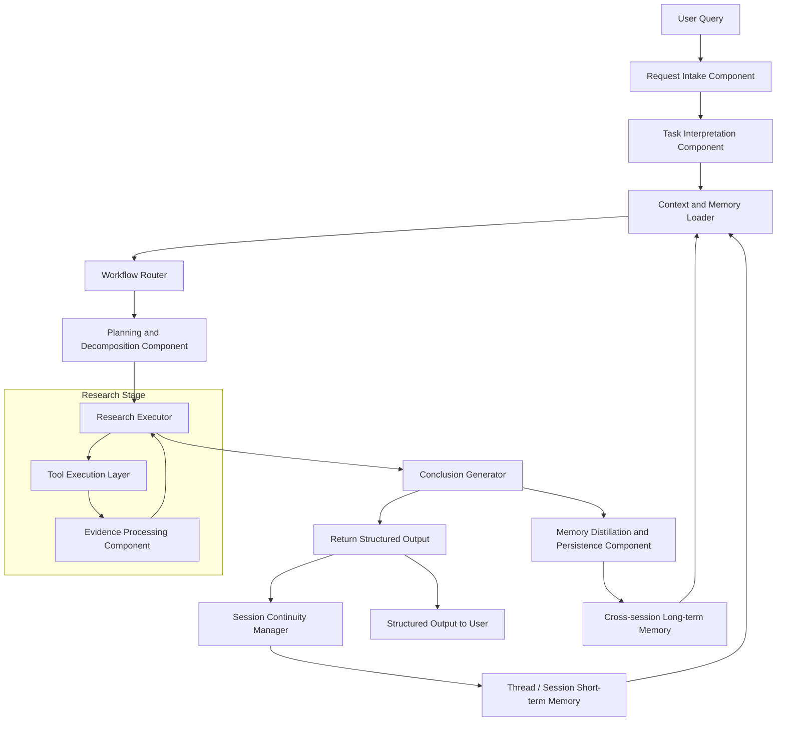

# System Architecture

## **Architecture Overview**

The system adopts a **workflow-driven outer architecture** with an **agentic inner execution loop**.

At a high level, the system is designed to support a full **research-to-action** workflow for AI-related research and engineering decision-making tasks. The outer workflow is fixed to ensure controllability, consistency, and predictable system behavior. Within this fixed workflow, the core research stage is executed through an agentic loop, where the LLM dynamically decides how to retrieve evidence, synthesize findings, and iterate when additional information is needed.

The architecture is organized around several core responsibilities: request interpretation, context and memory loading, workflow routing, optional planning and task decomposition, iterative research execution, evidence processing, conclusion generation, memory write-back, and response formatting. This design allows the system to handle different task types, such as topic exploration, comparison, recommendation, action planning, and update tracking, while preserving a shared architectural backbone.

The system is also designed as a **stateful architecture**. During each run, components cooperate through a shared running state and execution context. Across turns, session continuity is maintained through thread/session short-term memory. Across sessions, durable knowledge is stored in long-term memory, including project profile, research knowledge, decision records, action records, and user or system preferences. This separation enables the system to balance immediate task execution with long-term knowledge accumulation.

Overall, the architecture emphasizes four design principles:

- **Controlled workflow orchestration** through a fixed outer pipeline
- **Flexible reasoning and retrieval** through an agentic inner loop
- **Memory-aware execution** through short-term and long-term memory integration
- **Research-to-action output generation** through structured conclusions, recommendations, and reusable engineering artifacts

### High-Level Architecture Diagram




## End-to-End Workflow

### Top-level Workflow

```
Receive User Query (Fixed)
 |
\/
Interpret Request & Define Task (Fixed, LLM-driven)
 |
\/
Load Relevant Context & Memory (Fixed)
 |
\/
Route by Task Type (Fixed, Conditional)
 |
\/
Planning Decision and Task Decomposition (Fixed, LLM-driven)
 |
\/
Execute Research / Reasoning Loop (Fixed, Internal Process is agentic)
 |
\/
Generate Structured Conclusion (Fixed, Conditional + LLM-driven)
 |
\/
Distill & Write Back Memory (Fixed)
 |
\/
Return Structured Output (Fixed)
```

---

### Sub-steps

#### 1. Receive User Query (Fixed)

```
Receive User Query
 |
\/
Capture original_query
 |
\/
Initialize current run state
```

**Purpose**

Receive the input query and initialize task execution.

---

#### 2. Interpret Request & Define Task (Fixed, LLM-driven)

```
Interpret Request & Define Task
 |
\/
Infer user_goal
 |
\/
Classify task_type
 |
\/
Infer initial project_context
 |
\/
Infer initial constraints
```

**Purpose**

Understand what the user is actually trying to achieve, not just what was literally asked.

**Typical outputs**

- `user_goal`
- `task_type`
- `initial_project_context`
- `initial_constraints`

---

#### 3. Load Relevant Context & Memory (Fixed)

```
Load Relevant Context & Memory
 |
\/
Load thread / session short-term memory
 |
\/
Retrieve relevant long-term memory
 |
\/
Merge context for current task
```

**Purpose**

Load only the context and memory relevant to the current request.

**Typical sources**

- session context
- project profile memory
- research knowledge memory
- decision memory
- action / execution memory

**Notes**

The loaded information is incorporated into the current execution context. Task-relevant parts may then be mapped into running state fields such as `project_context` and `constraints`.

---

#### 4. Route by Task Type (Fixed, Conditional)

```
Route by Task Type
 |
+--> Topic Exploration Flow
 |
+--> Comparison Flow
 |
+--> Recommendation Flow
 |
+--> Action Planning Flow
 |
+--> Tracking / Update Flow (optional)
```

**Purpose**

Select the appropriate workflow pattern based on the task type.

**Why this is conditional**

Different task types require different downstream logic and output formats.

**What is the purpose of workflow patterns?**

The selected workflow pattern acts as the execution template for the remainder of the task. It determines which downstream steps should be emphasized, what types of evidence should be retrieved, how conclusions should be generated, what output format should be used, and what information should be written back into long-term memory.

---

#### 5. Planning Decision and Task Decomposition (Fixed, LLM-driven)

```
Planning Decision and Task Decomposition
 |
\/
Assess task complexity
 |
\/
Decide planning depth
 |
\/
Define execution objective
 |
\/
Generate initial plan if needed
 |
\/
Decompose into sub_questions if needed
 |
\/
Identify comparison_candidates if needed
 |
\/
Define initial evidence strategy if needed
```

**Purpose**

Determine how much explicit planning is required for the current request and decompose the task into manageable sub-questions when necessary.

**Typical outputs**

- optional `plan`
- optional `sub_questions`
- optional `comparison_candidates`
- optional `initial_evidence_strategy`
- optional `planning_depth`

**Notes**

For simple requests, explicit planning and decomposition may be skipped. In such cases, downstream execution may operate directly on the original query, inferred task objective, and loaded context.

---

#### 6. Execute Research / Reasoning Loop (Fixed, Internal Process is agentic)

```
Execute Research / Reasoning Loop
 |
\/
Select evidence needs (LLM-driven)
 |
\/
Retrieve evidence from tools / sources (Fixed)
 |
\/
Normalize / deduplicate evidence (Fixed)
 |
\/
Summarize evidence (LLM-driven)
 |
\/
Compare candidates if needed (Conditional)
 |
\/
Generate intermediate_findings (LLM-driven)
 |
\/
Assess evidence sufficiency and decide whether to continue iteration (LLM-driven)
 |
+--> If more evidence is needed, iterate again
 |
+--> If evidence is sufficient, exit the loop
```

**Purpose**

This is the core agentic part of the system. The outer step is fixed, but the internal strategy is dynamic.

**Typical outputs**

- `retrieved_evidence`
- `evidence_summary`
- `intermediate_findings`

**Notes**

If explicit planning outputs such as `sub_questions`, `comparison_candidates`, or `initial_evidence_strategy` are not available, the research loop may operate directly on the original query, inferred task objective, and current execution context.

If explicit comparison candidates are not produced during the planning stage, the research loop may infer or refine candidate options during execution when required by the task type.

---

#### 7. Generate Structured Conclusion (Fixed, Conditional + LLM-driven)

```
Generate Structured Conclusion
 |
+--> Topic Exploration Output
 |      |
 |      \/
 |   topic overview / key concepts / reading suggestions
 |
+--> Comparison Output
 |      |
 |      \/
 |   comparison matrix / trade-offs / pros and cons
 |
+--> Recommendation Output
 |      |
 |      \/
 |   final_recommendation / rationale / deferred options
 |
+--> Action Planning Output
        |
        \/
     action_items / experiment plan / roadmap / backlog
```

**Purpose**

Produce the final task-specific result in a structured form.

**Typical outputs may include**

- optional `final_recommendation`
- optional `action_items`
- optional `citations`
- optional `confidence`
- task-specific structured output

**Notes**

The exact structure of the conclusion depends on the task type, the selected workflow pattern, and the evidence collected during execution.

---

#### 8. Distill & Write Back Memory (Fixed)

```
Distill & Write Back Memory
 |
\/
Extract memory_candidates
 |
\/
Classify memory type
 |
+--> Project Profile Memory
 |
+--> Research Knowledge Memory
 |
+--> Decision Memory
 |
+--> Action / Execution Memory
 |
\/
Write structured records into long-term memory
```

**Purpose**

Persist only high-value and reusable information, rather than saving raw execution traces.

**Notes**

Memory candidate extraction identifies durable outputs from the current run, such as project updates, research conclusions, decision records, and action items. Memory classification then routes these outputs into the appropriate long-term memory category.

---

#### 9. Return Structured Output (Fixed)

```
Return Structured Output
 |
\/
Assemble final user-facing output
 |
\/
Apply task-appropriate output structure
 |
\/
Preserve session continuity
 |
\/
Return output to user
```

**Purpose**

Convert the conclusion-stage outputs into the final user-facing structured response and preserve the task-relevant subset of the current run for follow-up turns.

**Typical inputs**

- `task_type`
- `workflow_pattern`
- `final_recommendation` (if available)
- `action_items` (if available)
- `citations` (if available)
- `confidence` (if available)
- task-specific structured conclusion outputs
- updated `project_context`
- active task framing

**Typical outputs**

- final user-facing structured response
- updated thread/session short-term memory entries

**Internal behavior**

1. **Assemble final user-facing output**
Collect the outputs produced by the Conclusion Generator and organize them into a single response object for the current request.
2. **Apply task-appropriate output structure**
Present the result in a structure appropriate for the current task type, such as:
    - topic overview for topic exploration
    - comparison result for comparison tasks
    - recommendation and rationale for recommendation tasks
    - action items or roadmap for action planning tasks
3. **Preserve session continuity**
Store only the task-relevant subset of the current run into thread/session short-term memory, such as:
    - latest recommendation
    - latest action items
    - updated session project context
    - active task framing
4. **Return output to user**
Return the final structured response to the user-facing layer.

**Notes**

This step is intentionally kept lightweight. It does not perform evidence retrieval, recommendation generation, or deep reasoning. Its role is to finalize the output of the current run and ensure continuity for subsequent turns.

For the current system scope, this functionality is modeled as a final workflow step rather than a heavyweight standalone core component.

## State and Memory

### Overview

The system uses a layered state and memory design to support task execution, multi-turn continuity, and cross-session knowledge accumulation.

At a high level, the design separates:

- **Running State**, which contains the state fields used during task execution
- **Turn-local Working State**, which is used only within the current run
- **Thread / Session Short-term Memory**, which persists across multiple turns within the same session
- **Cross-session Long-term Memory**, which stores durable project knowledge and reusable research assets across sessions

This separation ensures that transient execution context does not pollute persistent memory, while still allowing high-value conclusions, decisions, and action plans to be reused in future interactions.

---

### Running State

Running State defines the full set of state fields that may be used during task execution. Depending on scope and lifetime, these fields are distributed across turn-local working state, thread/session short-term memory, and cross-session long-term memory.

#### Task Definition

- `original_query`: The original query submitted by the user.
- `user_goal`: The user’s actual intended goal.
    - **Why:** The user’s explicit question and the underlying objective are often not the same.
- `task_type`: The category of the current task, such as topic exploration, comparison, recommendation, or action planning.
    - **Why:** Different task types require different downstream workflows.
- `project_context`: The task-relevant project background synthesized from the current user input, session context, and previously stored project memory. It may include the current project stage, goals, implemented capabilities, known gaps, bottlenecks, relevant constraints, and prior decisions.
- `constraints`: The practical constraints of the current task.

#### Planning

- `plan`: The system’s execution plan for completing the task.
- `sub_questions`: The subproblems decomposed from the main question.

#### Evidence Processing

- `retrieved_evidence`: The raw evidence retrieved from external or internal sources.
- `evidence_summary`: The synthesized summary of the retrieved evidence.
- `comparison_candidates`: The candidate methods, tools, or options being compared.

#### Conclusion Generation

- `intermediate_findings`: Intermediate conclusions produced during task execution.
- `final_recommendation`: The final recommendation generated by the system.
- `action_items`: The follow-up actions generated from the recommendation.
- `citations`: Source references for key conclusions.
- `confidence`: The system’s confidence in the current conclusion.

#### Persistence

- `memory_candidates`: The results that may be worth writing into long-term memory after task completion.

---

### Memory Architecture

#### Turn-local Working State

Turn-local Working State contains temporary state used only within the current run. It supports task decomposition, evidence processing, intermediate reasoning, and final response generation. This layer is highly dynamic and should not be persisted by default.

Typical fields include:

- `plan`
- `sub_questions`
- `retrieved_evidence`
- `evidence_summary`
- `comparison_candidates`
- `intermediate_findings`
- `citations`
- `confidence`
- `memory_candidates`

This layer acts as the working space for the current task execution.

---

#### Thread / Session Short-term Memory

Thread / Session Short-term Memory contains context that should persist across multiple turns within the same thread or session. Its purpose is to support follow-up questions, preserve local continuity, and avoid re-establishing the same context repeatedly within the same conversation.

Typical fields include:

- `message_history`
- `active_user_goal`
- `active_task_type`
- `task_framing`
- `session_project_context`
- `session_constraints`
- `latest_recommendation`
- `latest_action_items`

For example, if the system recommends prioritizing evaluation over query rewrite in one turn, the recommendation and generated action items may remain available in session memory so that subsequent turns can continue the same line of work.

---

#### Cross-session Long-term Memory

Cross-session Long-term Memory stores durable information that remains valuable across different sessions. It is used to accumulate project knowledge, retain important research conclusions, preserve decision history, and maintain reusable execution assets.

Only distilled and reusable information should be written into this layer. Raw execution traces, temporary plans, and one-off intermediate artifacts should not be persisted by default.

**##### Project Profile Memory**

Project Profile Memory stores stable project-level background information.

Typical fields include:

- `project_name`
- `project_goal`
- `project_stage`
- `target_user`
- `tech_stack`
- `success_metrics`
- `long_lived_constraints`
- `current_bottlenecks`
- `project_priorities`

This memory type allows the system to understand the long-term context of the project without requiring the user to restate the same background information in every session.

---

**##### Research Knowledge Memory**

Research Knowledge Memory stores distilled research knowledge as structured records. It is intended to preserve reusable knowledge derived from papers, repositories, benchmarks, documentation, and prior research sessions.

Typical contents include:

- paper summaries
- method summaries
- tool/framework knowledge cards
- benchmark takeaways
- reading status
- topic summaries
- source-specific notes

Each entry should preferably be stored as a structured record with fields such as:

- `topic`
- `entity_name`
- `summary`
- `pros`
- `cons`
- `applicable_scenarios`
- `source_refs`
- `last_verified_at`

This memory type helps the system avoid repeatedly re-researching the same topic from scratch.

---

**##### Decision Memory**

Decision Memory stores important technical and product decisions made during research and planning. It captures not only the chosen option, but also the rationale, rejected alternatives, and revisit conditions.

Typical fields include:

- `decision_id`
- `decision_question`
- `chosen_option`
- `rationale`
- `rejected_alternatives`
- `applicable_context`
- `revisit_conditions`
- `confidence`
- `decision_date`
- `related_evidence_refs`

This memory type is particularly important for maintaining decision continuity. It allows the system to explain why a recommendation was made previously and whether that decision should still hold under the current context.

---

**##### Action / Execution Memory**

Action / Execution Memory stores reusable execution-oriented artifacts derived from research and decision-making. It connects research outputs to implementation and follow-up work.

Typical contents include:

- experiment plans
- implementation roadmaps
- backlog items
- open questions
- failed attempts
- experiment results
- next-step actions
- status snapshots

Each entry should preferably include:

- `status`
- `priority`
- `related_decision`
- `updated_at`

This memory type allows the system to continue execution-related work across sessions rather than treating each interaction as an isolated planning exercise.

---

**##### Preference Memory**

Preference Memory stores durable user- or project-level preferences that influence how research results should be generated and presented.

Typical contents include:

- engineering-oriented vs. research-oriented preference
- interview impact vs. infrastructure completeness preference
- preferred output format, such as table, checklist, or HLD-style structure
- default comparison dimensions, such as latency, cost, complexity, or maintainability

This memory type helps the system produce outputs that are better aligned with the user’s working style and project priorities.

---

**##### Research Policy Memory**

Research Policy Memory stores durable research and system policies that guide source selection, output behavior, and research workflow defaults.

Typical contents include:

- preferred source types
- source whitelist / blacklist
- default citation policy
- default recommendation-first policy
- domain-specific tracking policy

This memory type improves consistency and controllability across sessions.

---

**##### Tracking / Watchlist Memory (Optional)**

Tracking / Watchlist Memory stores continuous monitoring targets and their update status. It supports research tracking use cases in which the system periodically revisits selected topics, papers, repositories, or frameworks.

Typical contents include:

- tracking topics
- watched papers / repositories / frameworks
- `last_checked_at`
- change history
- alert thresholds
- subscription reasons

This memory type is optional and can be introduced in a later phase if continuous monitoring is included in the product scope.

---

**##### Memory Write-back Strategy**

Long-term memory should not store raw execution traces by default. Instead, the system should first identify high-value outputs from the running state, distill them into structured records, and then write them into the appropriate long-term memory category.

For example:

- stable project background updates should be written into **Project Profile Memory**
- distilled research conclusions should be written into **Research Knowledge Memory**
- major recommendations and trade-off conclusions should be written into **Decision Memory**
- experiment plans and next-step tasks should be written into **Action / Execution Memory**

This design prevents long-term memory from becoming a noisy collection of temporary execution artifacts.

---

**##### Memory Retrieval Strategy**

During task execution, the system should retrieve only the memory entries relevant to the current user goal, project context, and task type, rather than loading all available memory into the context window.

This selective retrieval strategy improves response quality, reduces noise, and controls context size. It also helps the system maintain relevance and consistency when handling long-running research workflows.

---

### Design Principle

The overall design principle is:

**Use short-lived state for execution, session memory for local continuity, and long-term memory for durable and reusable research assets.**

This separation allows the system to support complex research-to-action workflows while preserving both controllability and long-term usefulness.

## Core Components

The system is composed of a set of modular components that jointly support the full research-to-action workflow. Each component is responsible for a specific stage of execution, while sharing state and memory through the execution context.

### 1. Request Intake Component

**Responsibility**

Receive the user query and initialize the current task execution.

**Key outputs**

- `original_query`
- initialized run state

---

### 2. Task Interpretation Component

**Responsibility**

Interpret the request and transform it into a task-oriented representation, including user goal, task type, initial project context, and initial constraints.

**Key outputs**

- `user_goal`
- `task_type`
- `initial_project_context`
- `initial_constraints`

---

### 3. Context and Memory Loader

**Responsibility**

Load relevant thread/session short-term memory and long-term memory, and merge task-relevant information into the current execution context.

**Key outputs**

- enriched `project_context`
- enriched `constraints`
- relevant memory records in execution context

---

### 4. Workflow Router

**Responsibility**

Select the workflow pattern for the current task, such as topic exploration, comparison, recommendation, action planning, or tracking.

**Key outputs**

- selected workflow pattern
- downstream execution policy

---

### 5. Planning and Decomposition Component

**Responsibility**

Determine the required planning depth and generate explicit planning artifacts when needed.

**Key outputs may include**

- optional `plan`
- optional `sub_questions`
- optional `comparison_candidates`
- optional `initial_evidence_strategy`

---

### 6. Research Executor

**Responsibility**

Execute the core research and reasoning loop, including evidence acquisition decisions, iterative reasoning, and loop control.

**Key outputs**

- `retrieved_evidence`
- `intermediate_findings`

**Notes**

This is the most agentic component in the system.

---

### 7. Tool Execution Layer

**Responsibility**

Provide access to external and internal information sources required during research execution.

**Typical sources**

- papers
- repositories
- official documentation
- benchmarks
- internal memory stores

---

### 8. Evidence Processing Component

**Responsibility**

Process retrieved evidence into forms suitable for synthesis, comparison, recommendation, and conclusion generation.

**Key functions**

- evidence normalization
- deduplication
- summarization
- comparison preparation
- conflict and gap surfacing

**Notes**

For the MVP, this logic may be implemented within the Research Executor for simplicity, while remaining a separate logical component in the architecture.

---

### 9. Conclusion Generator

**Responsibility**

Generate the final structured conclusion according to the task type and workflow pattern.

**Key outputs may include**

- optional `final_recommendation`
- optional `action_items`
- optional `citations`
- optional `confidence`
- task-specific structured output

---

### 10. Memory Distillation and Persistence Component

**Responsibility**

Extract durable information from the current run and write it back into the appropriate long-term memory stores.

**Target memory types**

- Project Profile Memory
- Research Knowledge Memory
- Decision Memory
- Action / Execution Memory

---

### 11. Session Continuity Manager

**Responsibility**

Preserve the task-relevant subset of the current run for follow-up turns within the same thread or session.

**Typical preserved items**

- latest recommendation
- latest action items
- updated session project context
- active task framing

---

### Component Interaction Summary

At a high level, the system operates as follows:

1. The **Request Intake Component** receives the query.
2. The **Task Interpretation Component** identifies the task.
3. The **Context and Memory Loader** retrieves relevant context and memory.
4. The **Workflow Router** selects the workflow pattern.
5. The **Planning and Decomposition Component** determines whether explicit planning is needed.
6. The **Research Executor** performs iterative research with support from the **Tool and Retrieval Layer** and the **Evidence Processing Component**.
7. The **Conclusion Generator** produces the structured result.
8. The **Memory Distillation and Persistence Component** updates long-term memory.
9. The **Session Continuity Manager** preserves session-level continuity.

