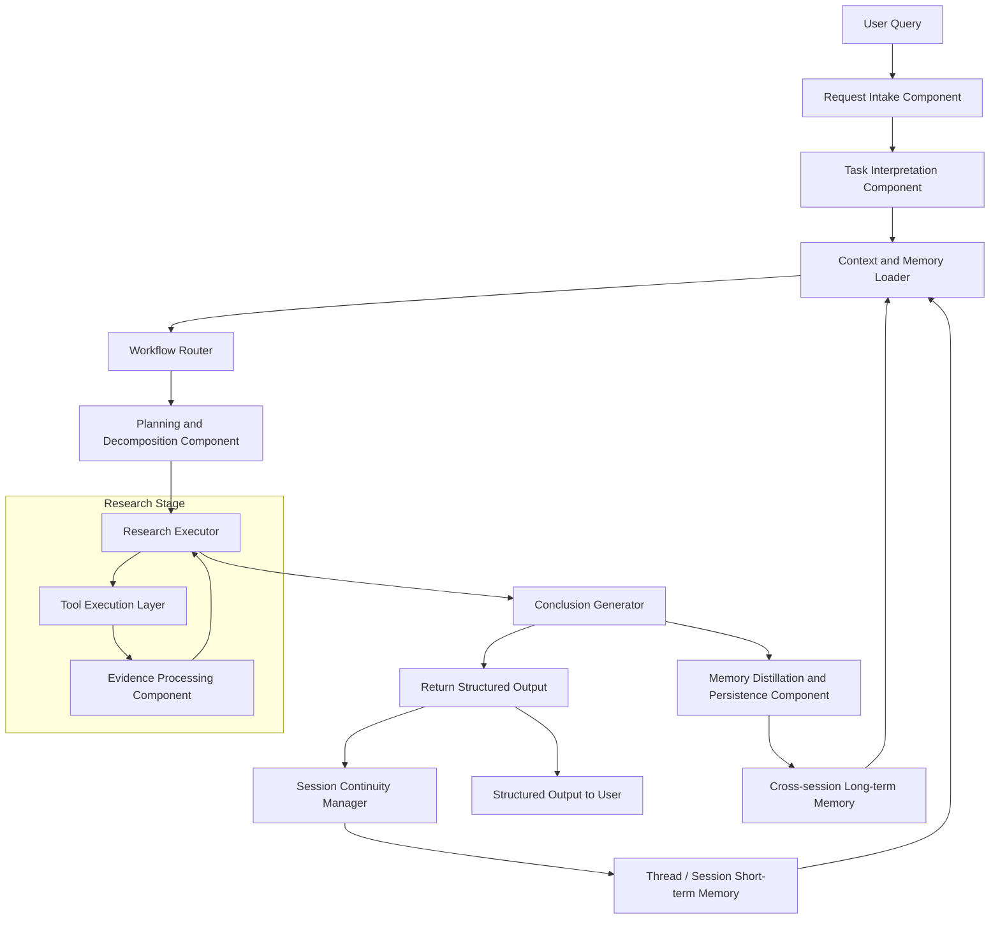

# Vertical AI Research & Action Agent

# Introduction

AI engineers and researchers often need to investigate technical topics, compare methods, evaluate trade-offs, and decide what to do next. In practice, this process is fragmented across many sources, including papers, repositories, documentation, benchmarks, blogs, and release notes. Although general-purpose AI assistants can help summarize information, they do not consistently support decision-oriented research workflows that require structured comparison, project-specific recommendations, persistent memory, and actionable outputs.

To address this gap, this project proposes a **vertical AI Research & Action Agent** focused on AI research and engineering decision-making. The system is designed to help users move from question formulation to evidence retrieval, comparative analysis, recommendation generation, and follow-up action planning in a single workflow. Its purpose is not to act as a general assistant, but to support repeated technical research tasks with grounded evidence, structured reasoning, and reusable outputs.

The primary goal of the system is to transform fragmented technical information into actionable engineering decisions and next steps. This document describes the high-level design of the system, including its use cases, requirements, architecture, and implementation scope.

# Use Case

The AI Research & Action Agent is designed for AI engineers and researchers who need to conduct technical research, compare candidate solutions, make engineering decisions, and convert research findings into actionable next steps.

Unlike a general-purpose research assistant, this system focuses on AI-related research and engineering workflows. Its value lies not only in retrieving information, but also in synthesizing evidence, generating decision-oriented recommendations, and producing actionable outputs that can support real project work.

---

## Primary Actor

- AI engineer / researcher / builder

## Supporting System Components

- Planning and reasoning subsystem
- Retrieval subsystem
- Tool calling subsystem
- Memory subsystem
- Action generation subsystem

---

## UC-1: Explore a Technical Topic

### Primary Actor

- User

### Goal

Help the user quickly understand an AI-related technical topic, including key concepts, representative methods, important papers, tools, and recent developments.

### Trigger

The user asks the system to research a technical topic, such as agentic RAG, model evaluation, multi-hop retrieval, long-context models, or an AI framework.

### Preconditions

- The user provides a topic or research question.
- The system has access to supported knowledge sources and retrieval tools.

### Main Flow

1. The user submits a topic or question.
2. The system identifies the scope of the topic and decomposes it into sub-questions.
3. The system retrieves relevant information from selected sources such as papers, repositories, technical blogs, documentation, and benchmarks.
4. The system filters redundant or low-value information.
5. The system synthesizes the retrieved evidence into a structured topic summary.
6. The system presents key concepts, representative references, and possible follow-up directions.

### Postconditions

- The user obtains a structured understanding of the topic.
- The system may store important findings in research memory for future reuse.

### Output

- Topic overview
- Key concepts and terminology
- Representative papers / repos / tools
- Suggested next reading directions

---

## UC-2: Compare Candidate Methods or Solutions

### Primary Actor

- User

### Goal

Help the user compare multiple technical methods, tools, or architectural choices for a specific AI problem.

### Trigger

The user asks the system to compare candidate options, such as Self-RAG vs. RAG-Fusion, FAISS vs. Milvus, or single-agent vs. multi-agent design.

### Preconditions

- The user provides at least two candidate options or a comparison objective.
- The system can retrieve evidence relevant to the candidates.

### Main Flow

1. The user specifies the candidates and the comparison objective.
2. The system identifies suitable comparison dimensions, such as effectiveness, complexity, cost, scalability, latency, implementation difficulty, and maintainability.
3. The system retrieves evidence for each candidate from relevant sources.
4. The system organizes and normalizes the findings.
5. The system generates a structured comparison.
6. The system provides a recommendation based on explicit or inferred user constraints.

### Postconditions

- The user receives a structured comparison and a recommendation.
- The system may record the comparison result and recommendation for future project continuity.

### Output

- Comparison matrix
- Pros and cons for each option
- Trade-off analysis
- Recommended option with rationale

---

## UC-3: Recommend a Technical Direction for the User’s Project

### Primary Actor

- User

### Goal

Help the user decide what technical direction to take next in their own AI project.

### Trigger

The user provides project context and asks for advice on what to prioritize or implement next.

### Preconditions

- The user provides project context such as current architecture, project phase, constraints, goals, or available resources.
- The system can access external research evidence and internal project memory.

### Main Flow

1. The user describes the current project context and decision point.
2. The system identifies the project stage, constraints, and open questions.
3. The system retrieves relevant external evidence related to the decision.
4. The system maps the external evidence to the user’s context.
5. The system proposes one or more feasible technical directions.
6. The system explains why a certain direction is recommended now and why other options may be postponed.

### Postconditions

- The user obtains project-specific recommendations.
- The system may store the recommendation and reasoning as part of project decision history.

### Output

- Context-aware recommendation
- Supporting rationale and evidence
- Prioritized next-step options
- Deferred options and reasons

---

## UC-4: Generate an Experiment or Implementation Plan

### Primary Actor

- User

### Goal

Convert a research conclusion or technical recommendation into an actionable plan.

### Trigger

The user asks the system to turn a research result into an execution plan, experiment plan, or development roadmap.

### Preconditions

- A topic has already been explored, compared, or recommended.
- The user provides an execution goal or asks for an actionable next step.

### Main Flow

1. The user requests an implementation plan or experiment plan.
2. The system identifies the target objective, constraints, dependencies, and expected outcomes.
3. The system decomposes the objective into executable tasks.
4. The system proposes milestones, evaluation criteria, risks, and dependencies.
5. The system generates a structured action plan.

### Postconditions

- The user obtains an actionable plan for execution.
- The system may store the generated plan as part of project memory.

### Output

- Experiment plan
- Implementation roadmap
- Task breakdown
- Evaluation metrics
- Risk and dependency list

---

## UC-5: Maintain Long-Term Research Memory

### Primary Actor

- User

### Goal

Persist research findings, decisions, and open questions so that future work can build on past work.

### Trigger

A research task, comparison task, or project decision has been completed, and the system needs to preserve important context.

### Preconditions

- The system has a memory module.
- There are meaningful findings, decisions, or open questions worth storing.

### Main Flow

1. The user completes one or more research-related interactions.
2. The system extracts key findings, selected options, rejected alternatives, and unresolved questions.
3. The system stores this information in structured memory.
4. During future interactions, the system retrieves relevant memory when similar topics or projects reappear.
5. The system uses prior memory to improve continuity and reduce repeated work.

### Postconditions

- Important research context is persisted.
- The system becomes cumulative rather than stateless.

### Output

- Structured research memory
- Decision history
- Open question backlog
- Reusable project context

---

## UC-6: Track Updates in a Research Area

### Primary Actor

- User

### Goal

Help the user continuously monitor changes in a selected AI research or engineering area.

### Trigger

The user asks the system to track a topic, method, model family, framework, or ecosystem over time.

### Preconditions

- The user specifies a topic or tracking target.
- The system has access to supported information sources.

### Main Flow

1. The user specifies a topic or area to track.
2. The system stores the tracking target and scope.
3. The system periodically retrieves newly available information from relevant sources.
4. The system compares new findings with previously stored knowledge.
5. The system identifies meaningful updates rather than repeating known information.
6. The system produces an incremental update summary and possible follow-up suggestions.

### Postconditions

- The user receives ongoing updates on a chosen area.
- The system maintains continuity between past and new findings.

### Output

- Update summary
- Newly identified papers / repos / releases
- Important changes since previous tracking
- Suggested follow-up actions

---

## UC-7: Produce Structured Research Deliverables

### Primary Actor

- User

### Goal

Convert research findings into reusable outputs that can be directly used in engineering work.

### Trigger

The user asks the system to generate a deliverable such as a design input, requirement draft, reading list, technical note, or project planning material.

### Preconditions

- Relevant research findings already exist in the current session or memory.
- The user specifies or implies a target deliverable type.

### Main Flow

1. The user requests a deliverable in a specific format.
2. The system gathers relevant findings from current reasoning, retrieval results, and stored memory.
3. The system reorganizes the information according to the target format.
4. The system generates the requested deliverable.

### Postconditions

- The user receives a structured output ready for downstream work.
- The deliverable may be stored or referenced in later sessions.

### Output

- Reading list
- Requirement draft
- Design input
- Technical comparison note
- Research summary for implementation planning

---

## MVP Use Case Scope

For the MVP, the recommended priority is:

- UC-1: Explore a Technical Topic
- UC-2: Compare Candidate Methods or Solutions
- UC-3: Recommend a Technical Direction for the User’s Project
- UC-4: Generate an Experiment or Implementation Plan

These four use cases form the minimum meaningful product loop:

**research → comparison → recommendation → action**

UC-5, UC-6, and UC-7 can be implemented in later phases to strengthen continuity, personalization, and long-term product differentiation.

---

## Summary

The core use cases of this system are not centered on generic question answering. Instead, they focus on helping the user complete a full AI research and engineering workflow: understanding a topic, comparing options, making context-aware decisions, generating execution plans, and accumulating reusable research knowledge over time.

# Requirement

## Functional Requirement

### FR-1 [MVP]: The system shall be able to understand research tasks and decompose them

The system shall be able to understand AI research or engineering decision-making questions raised by the user, and decompose complex tasks into executable subtasks such as topic understanding, candidate solution identification, evidence retrieval, comparative analysis, and action generation.

### FR-2 [MVP]: The system shall be able to retrieve information from multiple sources

The system shall be able to retrieve information from multiple AI-related sources, including but not limited to papers, code repositories, technical blogs, official documentation, benchmark information, and release notes.

### FR-3 [MVP]: The system shall be able to filter and synthesize retrieved results

The system shall be able to deduplicate, filter, rank, and synthesize retrieved results in order to reduce noise and retain the information most relevant to the user’s current task.

### FR-4 [MVP]: The system shall be able to generate structured research outputs

The system shall be able to generate structured outputs based on retrieved evidence and reasoning results, such as topic overviews, key concept explanations, representative method lists, recommended reading order, or research summaries, rather than only producing free-form responses.

### FR-5 [MVP]: The system shall be able to compare candidate methods or solutions

The system shall be able to compare multiple candidate methods, tools, or architectural options, and produce comparison results across dimensions such as effectiveness, complexity, cost, latency, scalability, and engineering implementation difficulty.

### FR-6 [MVP]: The system shall be able to provide decision-oriented recommendations

The system shall be able to generate recommendation-oriented conclusions for AI engineering decisions by combining external evidence with the user’s project context, and explain the rationale, applicable conditions, and reasons for not recommending alternative options at the current stage.

### FR-7 [MVP]: The system shall be able to generate follow-up actions from research results

The system shall be able to transform research conclusions into executable follow-up actions, such as experiment plans, implementation roadmaps, task breakdowns, evaluation plans, risk lists, or next-step learning plans.

### FR-8 [Phase 2]: The system shall be able to maintain long-term research memory

The system shall be able to store and retrieve key information related to the user’s long-term research activities, such as explored topics, reviewed papers, comparison results, architectural decisions, failed experiments, and unresolved questions, and reuse this information in future interactions.

### FR-9 [Phase 2]: The system shall be able to perform personalized analysis based on project context

The system shall be able to generate research conclusions and recommendations that are better aligned with the user’s actual project situation by incorporating project background information provided by the user or stored by the system, such as project stage, technology stack, resource constraints, performance targets, and current bottlenecks.

### FR-10 [Phase 2]: The system shall be able to track continuous updates in a research area

The system shall be able to continuously track a specified research topic, model, framework, or ecosystem, and produce incremental updates relative to existing knowledge rather than repeating already known content.

### FR-11 [Phase 2]: The system shall be able to generate reusable research deliverables

The system shall be able to convert research results into structured deliverables that can be directly used in downstream work, such as requirement drafts, design inputs, technical evaluation notes, reading lists, experiment plans, or project planning materials.

### FR-12 [All Phases]: The system shall be able to provide traceability for results

For important conclusions, comparison results, and recommendations, the system shall provide supporting sources or evidence references whenever possible, so that users can understand what the results are grounded in rather than receiving opaque black-box outputs.

### FR-13 [All Phases]: The system shall support user control over the research process

The system shall support user control over task scope, priorities, candidate options, output format, and research objectives, so that the research process remains controllable rather than being fully determined by the system autonomously.

---

## Non-Functional Requirement

### NFR-1: Accuracy and relevance

The system output shall remain highly relevant to the user’s current research objective whenever possible, and avoid unnecessary expansion, topic drift, or over-generalized responses that do not match the task.

### NFR-2: Traceability

For key conclusions, recommendations, and comparisons, the system shall provide source grounding or evidence references whenever possible, so that users can inspect the basis of the reasoning and the origin of the information.

### NFR-3: Consistency

For similar questions under the same project context, the system’s recommendation logic shall remain consistent unless external information, user constraints, or system memory has changed.

### NFR-4: Extensibility

The system architecture shall support the future integration of new data sources, tools, memory mechanisms, comparison dimensions, and output types without requiring major redesign of the core workflow.

### NFR-5: Maintainability

The system shall adopt a modular design so that components such as task planning, retrieval, memory, reasoning, action generation, and output formatting can evolve or be replaced independently.

### NFR-6: Response efficiency

For typical research tasks, the system shall complete the main research flow and return results within an acceptable time. For more complex tasks, the system shall be able to return intermediate results in stages rather than leaving the user without feedback for a long period.

### NFR-7: Robustness

When external information sources are unavailable, retrieval fails, or part of the tool chain encounters errors, the system shall degrade gracefully, preserve remaining capabilities where possible, and clearly communicate the limitations of the result instead of failing completely.

### NFR-8: Observability

The system shall provide basic process observability, such as recording task decomposition results, retrieval steps, candidate evidence, recommendation generation paths, and failure reasons, in order to support debugging and future optimization.

### NFR-9: Privacy and data security

The system shall reasonably protect project background information, research records, and long-term memory data provided by the user, and avoid unauthorized exposure, misuse, or unnecessary persistent storage.

### NFR-10: Cost controllability

The system shall balance effectiveness and resource consumption, and avoid unbounded retrieval, reasoning, or tool invocation for every research task.

### NFR-11: Structured output

The system shall prioritize outputs that are clearly structured, hierarchically organized, and reusable in engineering workflows, rather than relying only on long-form free text.

### NFR-12: Human-in-the-loop

The system design shall preserve the user’s final judgment by default. For recommendations, technical selections, and follow-up actions, the system shall serve as a decision-support tool rather than replacing the user’s final decision-making authority.

---

## Out Of Scope

### OOS-1: General-purpose personal assistant

This project does not aim to build a general-purpose personal assistant covering everyday life, office productivity, entertainment, shopping, travel, or other broad consumer scenarios.

### OOS-2: Cross-domain research system

This project does not aim to support all research domains. It is specifically focused on AI research and engineering decision-making tasks.

### OOS-3: Fully autonomous execution agent

This project does not aim to build a fully autonomous agent that can execute arbitrary external operations without supervision, especially not broad automation of high-risk, irreversible, or high-privilege write actions.

### OOS-4: Replacement of human research judgment

This project does not aim to replace the user’s technical judgment, research insight, or architectural decision-making. Instead, it provides evidence support, structured analysis, and actionable recommendations.

### OOS-5: Foundation model training or low-level model R&D

This project does not include foundation model training, general pretraining, low-level inference framework development, or research into the model’s intrinsic capabilities themselves.

### OOS-6: Full enterprise workflow orchestration platform

This project does not aim to build a full workflow orchestration platform similar to Dify, Coze, or other general-purpose agent platforms. It is focused on a specific vertical product capability for research and decision-support scenarios.

### OOS-7: Guarantee of absolute correctness or freshness

This project does not guarantee that all conclusions are absolutely correct, complete, or up to date in real time. Its goal is to improve research efficiency and decision quality, rather than provide unquestionable authoritative answers.

# System Architecture

## **Architecture Overview**

The system adopts a **workflow-driven outer architecture** with an **agentic inner execution loop**.

At a high level, the system is designed to support a full **research-to-action** workflow for AI-related research and engineering decision-making tasks. The outer workflow is fixed to ensure controllability, consistency, and predictable system behavior. Within this fixed workflow, the core research stage is executed through an agentic loop, where the LLM dynamically decides how to retrieve evidence, synthesize findings, and iterate when additional information is needed.

The architecture is organized around several core responsibilities: request interpretation, context and memory loading, workflow routing, optional planning and task decomposition, iterative research execution, evidence processing, conclusion generation, memory write-back, and response formatting. This design allows the system to handle different task types, such as topic exploration, comparison, recommendation, action planning, and update tracking, while preserving a shared architectural backbone.

The system is also designed as a **stateful architecture**. During each run, components cooperate through a shared running state and execution context. Across turns, session continuity is maintained through thread/session short-term memory. Across sessions, durable knowledge is stored in long-term memory, including project profile, research knowledge, decision records, action records, and user or system preferences. This separation enables the system to balance immediate task execution with long-term knowledge accumulation.

Overall, the architecture emphasizes four design principles:

- **Controlled workflow orchestration** through a fixed outer pipeline
- **Flexible reasoning and retrieval** through an agentic inner loop
- **Memory-aware execution** through short-term and long-term memory integration
- **Research-to-action output generation** through structured conclusions, recommendations, and reusable engineering artifacts

### High-Level Architecture Diagram




## End-to-End Workflow

### Top-level Workflow

```
Receive User Query (Fixed)
 |
\/
Interpret Request & Define Task (Fixed, LLM-driven)
 |
\/
Load Relevant Context & Memory (Fixed)
 |
\/
Route by Task Type (Fixed, Conditional)
 |
\/
Planning Decision and Task Decomposition (Fixed, LLM-driven)
 |
\/
Execute Research / Reasoning Loop (Fixed, Internal Process is agentic)
 |
\/
Generate Structured Conclusion (Fixed, Conditional + LLM-driven)
 |
\/
Distill & Write Back Memory (Fixed)
 |
\/
Return Structured Output (Fixed)
```

---

### Sub-steps

#### 1. Receive User Query (Fixed)

```
Receive User Query
 |
\/
Capture original_query
 |
\/
Initialize current run state
```

**Purpose**

Receive the input query and initialize task execution.

---

#### 2. Interpret Request & Define Task (Fixed, LLM-driven)

```
Interpret Request & Define Task
 |
\/
Infer user_goal
 |
\/
Classify task_type
 |
\/
Infer initial project_context
 |
\/
Infer initial constraints
```

**Purpose**

Understand what the user is actually trying to achieve, not just what was literally asked.

**Typical outputs**

- `user_goal`
- `task_type`
- `initial_project_context`
- `initial_constraints`

---

#### 3. Load Relevant Context & Memory (Fixed)

```
Load Relevant Context & Memory
 |
\/
Load thread / session short-term memory
 |
\/
Retrieve relevant long-term memory
 |
\/
Merge context for current task
```

**Purpose**

Load only the context and memory relevant to the current request.

**Typical sources**

- session context
- project profile memory
- research knowledge memory
- decision memory
- action / execution memory

**Notes**

The loaded information is incorporated into the current execution context. Task-relevant parts may then be mapped into running state fields such as `project_context` and `constraints`.

---

#### 4. Route by Task Type (Fixed, Conditional)

```
Route by Task Type
 |
+--> Topic Exploration Flow
 |
+--> Comparison Flow
 |
+--> Recommendation Flow
 |
+--> Action Planning Flow
 |
+--> Tracking / Update Flow (optional)
```

**Purpose**

Select the appropriate workflow pattern based on the task type.

**Why this is conditional**

Different task types require different downstream logic and output formats.

**What is the purpose of workflow patterns?**

The selected workflow pattern acts as the execution template for the remainder of the task. It determines which downstream steps should be emphasized, what types of evidence should be retrieved, how conclusions should be generated, what output format should be used, and what information should be written back into long-term memory.

---

#### 5. Planning Decision and Task Decomposition (Fixed, LLM-driven)

```
Planning Decision and Task Decomposition
 |
\/
Assess task complexity
 |
\/
Decide planning depth
 |
\/
Define execution objective
 |
\/
Generate initial plan if needed
 |
\/
Decompose into sub_questions if needed
 |
\/
Identify comparison_candidates if needed
 |
\/
Define initial evidence strategy if needed
```

**Purpose**

Determine how much explicit planning is required for the current request and decompose the task into manageable sub-questions when necessary.

**Typical outputs**

- optional `plan`
- optional `sub_questions`
- optional `comparison_candidates`
- optional `initial_evidence_strategy`
- optional `planning_depth`

**Notes**

For simple requests, explicit planning and decomposition may be skipped. In such cases, downstream execution may operate directly on the original query, inferred task objective, and loaded context.

---

#### 6. Execute Research / Reasoning Loop (Fixed, Internal Process is agentic)

```
Execute Research / Reasoning Loop
 |
\/
Select evidence needs (LLM-driven)
 |
\/
Retrieve evidence from tools / sources (Fixed)
 |
\/
Normalize / deduplicate evidence (Fixed)
 |
\/
Summarize evidence (LLM-driven)
 |
\/
Compare candidates if needed (Conditional)
 |
\/
Generate intermediate_findings (LLM-driven)
 |
\/
Assess evidence sufficiency and decide whether to continue iteration (LLM-driven)
 |
+--> If more evidence is needed, iterate again
 |
+--> If evidence is sufficient, exit the loop
```

**Purpose**

This is the core agentic part of the system. The outer step is fixed, but the internal strategy is dynamic.

**Typical outputs**

- `retrieved_evidence`
- `evidence_summary`
- `intermediate_findings`

**Notes**

If explicit planning outputs such as `sub_questions`, `comparison_candidates`, or `initial_evidence_strategy` are not available, the research loop may operate directly on the original query, inferred task objective, and current execution context.

If explicit comparison candidates are not produced during the planning stage, the research loop may infer or refine candidate options during execution when required by the task type.

---

#### 7. Generate Structured Conclusion (Fixed, Conditional + LLM-driven)

```
Generate Structured Conclusion
 |
+--> Topic Exploration Output
 |      |
 |      \/
 |   topic overview / key concepts / reading suggestions
 |
+--> Comparison Output
 |      |
 |      \/
 |   comparison matrix / trade-offs / pros and cons
 |
+--> Recommendation Output
 |      |
 |      \/
 |   final_recommendation / rationale / deferred options
 |
+--> Action Planning Output
        |
        \/
     action_items / experiment plan / roadmap / backlog
```

**Purpose**

Produce the final task-specific result in a structured form.

**Typical outputs may include**

- optional `final_recommendation`
- optional `action_items`
- optional `citations`
- optional `confidence`
- task-specific structured output

**Notes**

The exact structure of the conclusion depends on the task type, the selected workflow pattern, and the evidence collected during execution.

---

#### 8. Distill & Write Back Memory (Fixed)

```
Distill & Write Back Memory
 |
\/
Extract memory_candidates
 |
\/
Classify memory type
 |
+--> Project Profile Memory
 |
+--> Research Knowledge Memory
 |
+--> Decision Memory
 |
+--> Action / Execution Memory
 |
\/
Write structured records into long-term memory
```

**Purpose**

Persist only high-value and reusable information, rather than saving raw execution traces.

**Notes**

Memory candidate extraction identifies durable outputs from the current run, such as project updates, research conclusions, decision records, and action items. Memory classification then routes these outputs into the appropriate long-term memory category.

---

#### 9. Return Structured Output (Fixed)

```
Return Structured Output
 |
\/
Assemble final user-facing output
 |
\/
Apply task-appropriate output structure
 |
\/
Preserve session continuity
 |
\/
Return output to user
```

**Purpose**

Convert the conclusion-stage outputs into the final user-facing structured response and preserve the task-relevant subset of the current run for follow-up turns.

**Typical inputs**

- `task_type`
- `workflow_pattern`
- `final_recommendation` (if available)
- `action_items` (if available)
- `citations` (if available)
- `confidence` (if available)
- task-specific structured conclusion outputs
- updated `project_context`
- active task framing

**Typical outputs**

- final user-facing structured response
- updated thread/session short-term memory entries

**Internal behavior**

1. **Assemble final user-facing output**
Collect the outputs produced by the Conclusion Generator and organize them into a single response object for the current request.
2. **Apply task-appropriate output structure**
Present the result in a structure appropriate for the current task type, such as:
    - topic overview for topic exploration
    - comparison result for comparison tasks
    - recommendation and rationale for recommendation tasks
    - action items or roadmap for action planning tasks
3. **Preserve session continuity**
Store only the task-relevant subset of the current run into thread/session short-term memory, such as:
    - latest recommendation
    - latest action items
    - updated session project context
    - active task framing
4. **Return output to user**
Return the final structured response to the user-facing layer.

**Notes**

This step is intentionally kept lightweight. It does not perform evidence retrieval, recommendation generation, or deep reasoning. Its role is to finalize the output of the current run and ensure continuity for subsequent turns.

For the current system scope, this functionality is modeled as a final workflow step rather than a heavyweight standalone core component.

## State and Memory

### Overview

The system uses a layered state and memory design to support task execution, multi-turn continuity, and cross-session knowledge accumulation.

At a high level, the design separates:

- **Running State**, which contains the state fields used during task execution
- **Turn-local Working State**, which is used only within the current run
- **Thread / Session Short-term Memory**, which persists across multiple turns within the same session
- **Cross-session Long-term Memory**, which stores durable project knowledge and reusable research assets across sessions

This separation ensures that transient execution context does not pollute persistent memory, while still allowing high-value conclusions, decisions, and action plans to be reused in future interactions.

---

### Running State

Running State defines the full set of state fields that may be used during task execution. Depending on scope and lifetime, these fields are distributed across turn-local working state, thread/session short-term memory, and cross-session long-term memory.

#### Task Definition

- `original_query`: The original query submitted by the user.
- `user_goal`: The user’s actual intended goal.
    - **Why:** The user’s explicit question and the underlying objective are often not the same.
- `task_type`: The category of the current task, such as topic exploration, comparison, recommendation, or action planning.
    - **Why:** Different task types require different downstream workflows.
- `project_context`: The task-relevant project background synthesized from the current user input, session context, and previously stored project memory. It may include the current project stage, goals, implemented capabilities, known gaps, bottlenecks, relevant constraints, and prior decisions.
- `constraints`: The practical constraints of the current task.

#### Planning

- `plan`: The system’s execution plan for completing the task.
- `sub_questions`: The subproblems decomposed from the main question.

#### Evidence Processing

- `retrieved_evidence`: The raw evidence retrieved from external or internal sources.
- `evidence_summary`: The synthesized summary of the retrieved evidence.
- `comparison_candidates`: The candidate methods, tools, or options being compared.

#### Conclusion Generation

- `intermediate_findings`: Intermediate conclusions produced during task execution.
- `final_recommendation`: The final recommendation generated by the system.
- `action_items`: The follow-up actions generated from the recommendation.
- `citations`: Source references for key conclusions.
- `confidence`: The system’s confidence in the current conclusion.

#### Persistence

- `memory_candidates`: The results that may be worth writing into long-term memory after task completion.

---

### Memory Architecture

#### Turn-local Working State

Turn-local Working State contains temporary state used only within the current run. It supports task decomposition, evidence processing, intermediate reasoning, and final response generation. This layer is highly dynamic and should not be persisted by default.

Typical fields include:

- `plan`
- `sub_questions`
- `retrieved_evidence`
- `evidence_summary`
- `comparison_candidates`
- `intermediate_findings`
- `citations`
- `confidence`
- `memory_candidates`

This layer acts as the working space for the current task execution.

---

#### Thread / Session Short-term Memory

Thread / Session Short-term Memory contains context that should persist across multiple turns within the same thread or session. Its purpose is to support follow-up questions, preserve local continuity, and avoid re-establishing the same context repeatedly within the same conversation.

Typical fields include:

- `message_history`
- `active_user_goal`
- `active_task_type`
- `task_framing`
- `session_project_context`
- `session_constraints`
- `latest_recommendation`
- `latest_action_items`

For example, if the system recommends prioritizing evaluation over query rewrite in one turn, the recommendation and generated action items may remain available in session memory so that subsequent turns can continue the same line of work.

---

#### Cross-session Long-term Memory

Cross-session Long-term Memory stores durable information that remains valuable across different sessions. It is used to accumulate project knowledge, retain important research conclusions, preserve decision history, and maintain reusable execution assets.

Only distilled and reusable information should be written into this layer. Raw execution traces, temporary plans, and one-off intermediate artifacts should not be persisted by default.

**##### Project Profile Memory**

Project Profile Memory stores stable project-level background information.

Typical fields include:

- `project_name`
- `project_goal`
- `project_stage`
- `target_user`
- `tech_stack`
- `success_metrics`
- `long_lived_constraints`
- `current_bottlenecks`
- `project_priorities`

This memory type allows the system to understand the long-term context of the project without requiring the user to restate the same background information in every session.

---

**##### Research Knowledge Memory**

Research Knowledge Memory stores distilled research knowledge as structured records. It is intended to preserve reusable knowledge derived from papers, repositories, benchmarks, documentation, and prior research sessions.

Typical contents include:

- paper summaries
- method summaries
- tool/framework knowledge cards
- benchmark takeaways
- reading status
- topic summaries
- source-specific notes

Each entry should preferably be stored as a structured record with fields such as:

- `topic`
- `entity_name`
- `summary`
- `pros`
- `cons`
- `applicable_scenarios`
- `source_refs`
- `last_verified_at`

This memory type helps the system avoid repeatedly re-researching the same topic from scratch.

---

**##### Decision Memory**

Decision Memory stores important technical and product decisions made during research and planning. It captures not only the chosen option, but also the rationale, rejected alternatives, and revisit conditions.

Typical fields include:

- `decision_id`
- `decision_question`
- `chosen_option`
- `rationale`
- `rejected_alternatives`
- `applicable_context`
- `revisit_conditions`
- `confidence`
- `decision_date`
- `related_evidence_refs`

This memory type is particularly important for maintaining decision continuity. It allows the system to explain why a recommendation was made previously and whether that decision should still hold under the current context.

---

**##### Action / Execution Memory**

Action / Execution Memory stores reusable execution-oriented artifacts derived from research and decision-making. It connects research outputs to implementation and follow-up work.

Typical contents include:

- experiment plans
- implementation roadmaps
- backlog items
- open questions
- failed attempts
- experiment results
- next-step actions
- status snapshots

Each entry should preferably include:

- `status`
- `priority`
- `related_decision`
- `updated_at`

This memory type allows the system to continue execution-related work across sessions rather than treating each interaction as an isolated planning exercise.

---

**##### Preference Memory**

Preference Memory stores durable user- or project-level preferences that influence how research results should be generated and presented.

Typical contents include:

- engineering-oriented vs. research-oriented preference
- interview impact vs. infrastructure completeness preference
- preferred output format, such as table, checklist, or HLD-style structure
- default comparison dimensions, such as latency, cost, complexity, or maintainability

This memory type helps the system produce outputs that are better aligned with the user’s working style and project priorities.

---

**##### Research Policy Memory**

Research Policy Memory stores durable research and system policies that guide source selection, output behavior, and research workflow defaults.

Typical contents include:

- preferred source types
- source whitelist / blacklist
- default citation policy
- default recommendation-first policy
- domain-specific tracking policy

This memory type improves consistency and controllability across sessions.

---

**##### Tracking / Watchlist Memory (Optional)**

Tracking / Watchlist Memory stores continuous monitoring targets and their update status. It supports research tracking use cases in which the system periodically revisits selected topics, papers, repositories, or frameworks.

Typical contents include:

- tracking topics
- watched papers / repositories / frameworks
- `last_checked_at`
- change history
- alert thresholds
- subscription reasons

This memory type is optional and can be introduced in a later phase if continuous monitoring is included in the product scope.

---

**##### Memory Write-back Strategy**

Long-term memory should not store raw execution traces by default. Instead, the system should first identify high-value outputs from the running state, distill them into structured records, and then write them into the appropriate long-term memory category.

For example:

- stable project background updates should be written into **Project Profile Memory**
- distilled research conclusions should be written into **Research Knowledge Memory**
- major recommendations and trade-off conclusions should be written into **Decision Memory**
- experiment plans and next-step tasks should be written into **Action / Execution Memory**

This design prevents long-term memory from becoming a noisy collection of temporary execution artifacts.

---

**##### Memory Retrieval Strategy**

During task execution, the system should retrieve only the memory entries relevant to the current user goal, project context, and task type, rather than loading all available memory into the context window.

This selective retrieval strategy improves response quality, reduces noise, and controls context size. It also helps the system maintain relevance and consistency when handling long-running research workflows.

---

### Design Principle

The overall design principle is:

**Use short-lived state for execution, session memory for local continuity, and long-term memory for durable and reusable research assets.**

This separation allows the system to support complex research-to-action workflows while preserving both controllability and long-term usefulness.

## Core Components

The system is composed of a set of modular components that jointly support the full research-to-action workflow. Each component is responsible for a specific stage of execution, while sharing state and memory through the execution context.

### 1. Request Intake Component

**Responsibility**

Receive the user query and initialize the current task execution.

**Key outputs**

- `original_query`
- initialized run state

---

### 2. Task Interpretation Component

**Responsibility**

Interpret the request and transform it into a task-oriented representation, including user goal, task type, initial project context, and initial constraints.

**Key outputs**

- `user_goal`
- `task_type`
- `initial_project_context`
- `initial_constraints`

---

### 3. Context and Memory Loader

**Responsibility**

Load relevant thread/session short-term memory and long-term memory, and merge task-relevant information into the current execution context.

**Key outputs**

- enriched `project_context`
- enriched `constraints`
- relevant memory records in execution context

---

### 4. Workflow Router

**Responsibility**

Select the workflow pattern for the current task, such as topic exploration, comparison, recommendation, action planning, or tracking.

**Key outputs**

- selected workflow pattern
- downstream execution policy

---

### 5. Planning and Decomposition Component

**Responsibility**

Determine the required planning depth and generate explicit planning artifacts when needed.

**Key outputs may include**

- optional `plan`
- optional `sub_questions`
- optional `comparison_candidates`
- optional `initial_evidence_strategy`

---

### 6. Research Executor

**Responsibility**

Execute the core research and reasoning loop, including evidence acquisition decisions, iterative reasoning, and loop control.

**Key outputs**

- `retrieved_evidence`
- `intermediate_findings`

**Notes**

This is the most agentic component in the system.

---

### 7. Tool Execution Layer

**Responsibility**

Provide access to external and internal information sources required during research execution.

**Typical sources**

- papers
- repositories
- official documentation
- benchmarks
- internal memory stores

---

### 8. Evidence Processing Component

**Responsibility**

Process retrieved evidence into forms suitable for synthesis, comparison, recommendation, and conclusion generation.

**Key functions**

- evidence normalization
- deduplication
- summarization
- comparison preparation
- conflict and gap surfacing

**Notes**

For the MVP, this logic may be implemented within the Research Executor for simplicity, while remaining a separate logical component in the architecture.

---

### 9. Conclusion Generator

**Responsibility**

Generate the final structured conclusion according to the task type and workflow pattern.

**Key outputs may include**

- optional `final_recommendation`
- optional `action_items`
- optional `citations`
- optional `confidence`
- task-specific structured output

---

### 10. Memory Distillation and Persistence Component

**Responsibility**

Extract durable information from the current run and write it back into the appropriate long-term memory stores.

**Target memory types**

- Project Profile Memory
- Research Knowledge Memory
- Decision Memory
- Action / Execution Memory

---

### 11. Session Continuity Manager

**Responsibility**

Preserve the task-relevant subset of the current run for follow-up turns within the same thread or session.

**Typical preserved items**

- latest recommendation
- latest action items
- updated session project context
- active task framing

---

### Component Interaction Summary

At a high level, the system operates as follows:

1. The **Request Intake Component** receives the query.
2. The **Task Interpretation Component** identifies the task.
3. The **Context and Memory Loader** retrieves relevant context and memory.
4. The **Workflow Router** selects the workflow pattern.
5. The **Planning and Decomposition Component** determines whether explicit planning is needed.
6. The **Research Executor** performs iterative research with support from the **Tool and Retrieval Layer** and the **Evidence Processing Component**.
7. The **Conclusion Generator** produces the structured result.
8. The **Memory Distillation and Persistence Component** updates long-term memory.
9. The **Session Continuity Manager** preserves session-level continuity.

## Architectural Decisions

### Orchestration Architecture

This system considers three orchestration architecture options: **pure workflow**, **workflow-driven outer architecture with an agentic inner loop**, and **fully autonomous agent**. These options mainly differ in how much of the execution path is predefined in code versus dynamically decided by the LLM.

#### Option 1. Pure Workflow

In a pure workflow architecture, the system follows predefined execution paths, and the LLM is used only within fixed steps rather than controlling the overall process. This approach provides strong predictability, consistency, and debuggability, and is well-suited for tasks that can be cleanly decomposed into stable steps with clear success criteria. It is also easier to test, evaluate, and constrain operationally. However, pure workflow is less flexible when the system must dynamically decide what evidence to gather, how many iterations are needed, or how to adapt reasoning based on intermediate findings. As task complexity and variability increase, the number of hardcoded branches can grow significantly, making the workflow rigid or difficult to maintain.

**Pros**

- High predictability and controllability
- Easier debugging and evaluation
- Stable latency and operational behavior
- Suitable for well-defined and repetitive tasks

**Cons**

- Limited flexibility for open-ended research tasks
- Harder to adapt dynamically to unexpected intermediate results
- May require many explicit branches as task variability increases

---

#### Option 2. Workflow-driven Outer Architecture with Agentic Inner Loop (Recommended)

In this architecture, the outer pipeline remains fixed, while the core research stage is handled through an agentic loop in which the LLM dynamically selects evidence needs, iterates on retrieval and reasoning, and decides when enough information has been collected. This architecture combines the strengths of workflow and agent-based systems: the fixed outer workflow preserves control, transparency, and architectural clarity, while the inner loop provides the flexibility needed for complex research tasks that cannot be fully predefined. It is particularly suitable when the overall lifecycle of a request is stable, but the evidence-gathering and reasoning strategy must remain adaptive. Its main disadvantage is that the boundary between fixed orchestration and dynamic agent behavior must be designed carefully; otherwise, responsibilities may become unclear or duplicated. It is also more complex than a pure workflow, although still more governable than a fully autonomous agent.

**Pros**

- Balances controllability and flexibility
- Preserves a stable outer lifecycle while enabling adaptive research behavior
- Easier to explain and govern than a fully autonomous agent
- Better suited for evidence-driven recommendation and iterative research tasks

**Cons**

- More complex than pure workflow
- Requires careful boundary design between workflow logic and agentic logic
- Debugging is harder than in fully predefined workflows

---

#### Option 3. Fully Autonomous Agent

In a fully autonomous agent architecture, the LLM dynamically plans, selects tools, controls iterations, and determines how to complete the task with minimal predefined orchestration. This option provides the highest level of flexibility and is most suitable for open-ended tasks where the number of steps, tools, or subtasks cannot be predicted in advance. It can be highly effective for domains such as open-ended search, coding agents, or computer-use tasks, especially when the environment provides strong feedback signals. However, this flexibility comes with higher latency, higher cost, weaker predictability, and greater risk of compounding errors. It also requires stronger guardrails, better sandboxing, and more extensive evaluation. As a result, it is usually less suitable for systems that require strong control, stable behavior, and clear intermediate structure.

**Pros**

- Highest flexibility
- Handles open-ended tasks with unpredictable step counts
- Naturally supports dynamic planning and tool usage
- High upside for complex, loosely structured tasks

**Cons**

- Higher latency and cost
- Greater risk of compounding errors
- Harder to debug, evaluate, and govern
- Requires stronger guardrails and operational safeguards

### Agent Topology

This system considers two agent topology options: **single-agent** and **multi-agent**. These options mainly differ in whether task execution is controlled by one primary agent or distributed across multiple specialized agents.

#### Option 1. Single-agent (Recommended)

In a single-agent architecture, one primary agent is responsible for the core task execution, including reasoning, evidence selection, and decision-making, while other capabilities are provided through tools, memory, and supporting workflow components. This approach offers a simpler control flow, clearer ownership of task execution, and lower orchestration overhead. It is typically easier to implement, debug, evaluate, and explain, especially in the early stages of system design or MVP development.

The main limitation of a single-agent architecture is that the primary agent may become overloaded as the system grows. If the agent must manage too many tools, too much context, or too many distinct reasoning modes, its effectiveness may degrade. It is also less suitable when the system requires strong specialization, strict context isolation, or parallel handling of multiple subtasks.

**Pros**

- Lower architectural complexity
- Clearer control flow and easier debugging
- Easier evaluation and observability
- Faster to implement for MVP scope
- Easier to explain and maintain in early-stage systems

**Cons**

- Risk of a single large and overloaded controller
- Less suitable for strong specialization
- Weaker context isolation across distinct subtasks
- Limited support for parallel subtask execution

---

#### Option 2. Multi-agent

In a multi-agent architecture, execution is distributed across multiple specialized agents, each responsible for a particular role, task type, or reasoning scope. Examples may include separate agents for planning, retrieval, comparison, recommendation, or action generation. This approach can improve specialization, allow stricter context isolation, and make it easier to assign different prompts, tools, or memory scopes to different agents. It can also better support parallel execution when multiple subtasks can be processed independently.

The main drawback of a multi-agent architecture is its significantly higher orchestration complexity. The system must define agent boundaries, routing logic, handoff mechanisms, inter-agent communication, and result aggregation. It is also harder to debug and evaluate because failures may emerge from coordination problems rather than from any single agent. In addition, a multi-agent system may increase latency, token cost, and overall implementation complexity if the decomposition does not provide clear benefits.

**Pros**

- Stronger specialization
- Better context isolation
- Better support for parallelizable subtasks
- Clearer separation of responsibilities in large systems
- More extensible when different capabilities evolve independently

**Cons**

- Higher orchestration complexity
- Harder debugging and evaluation
- More complex context engineering
- Higher latency and token cost
- Risk of unnecessary over-engineering if task decomposition does not provide clear value

---

#### Comparative Assessment

From an architectural perspective, the two options can be summarized as follows:

- **Single-agent** provides lower complexity, clearer execution flow, and faster implementation.
- **Multi-agent** provides stronger specialization, clearer responsibility separation, and better support for context isolation and parallelism.

For systems with a coherent primary task, manageable tool scope, and strong need for controllability, a single-agent architecture is often the more practical choice. For systems in which subtasks require clearly different capabilities, prompts, tools, or isolated reasoning contexts, a multi-agent architecture may provide better long-term scalability.

---

#### Selected Direction

This design adopts a **single-agent topology** for the current system.

The main reason is that the system currently has one coherent primary task: to support research-to-action workflows through evidence retrieval, reasoning, recommendation, and action generation. At the current scope, these functions can be effectively coordinated by one primary agent supported by tools, memory, and workflow components. A multi-agent design would introduce additional orchestration complexity without providing sufficient benefit for the MVP.

This choice does not prevent future evolution toward a multi-agent architecture. If the system later requires stronger specialization, clearer separation of reasoning roles, or parallel handling of complex subtasks, selected components may be promoted into specialized agents in a later phase.

### State & Memory Architecture

This system considers three main state and memory architecture options: **stateless**, **session-only memory**, and **stateful memory-aware architecture with long-term memory**.

#### Option 1. Stateless

In a stateless architecture, each request is processed independently without relying on persisted session context or long-term memory. This approach provides the lowest architectural complexity and the clearest operational behavior. It is easier to implement, debug, and govern, and is suitable for one-shot tasks or scenarios in which the user provides all required context in each request. However, it does not support multi-turn continuity, project-level context accumulation, or reuse of prior research outcomes.

**Pros**

- Lowest complexity
- Easier debugging and observability
- No memory retrieval or write-back logic
- Lower risk of stale or polluted memory

**Cons**

- No multi-turn continuity
- No project-level persistence
- No reuse of prior decisions or research artifacts
- Weak support for long-running research workflows

#### Option 2. Session-only Memory

In a session-only architecture, the system preserves context within the same thread or session, but does not maintain cross-session long-term memory. This improves follow-up interactions and allows the system to continue the current line of work within a conversation, while avoiding the complexity of long-term memory management. However, continuity is limited to the current session, and the system cannot persist reusable knowledge or decisions across sessions.

**Pros**

- Better multi-turn continuity than stateless
- Lower complexity than long-term memory architecture
- Easier to manage than cross-session persistence
- Suitable for bounded research sessions

**Cons**

- No cross-session continuity
- No durable project memory
- No persistent reuse of research conclusions or action plans
- Limited support for long-term project workflows

#### Option 3. Stateful, Memory-aware Architecture with Long-term Memory  (Recommended)

In a stateful, memory-aware architecture, the system maintains running state for the current task, session-level short-term memory for thread continuity, and cross-session long-term memory for durable project knowledge. This allows the system to preserve project background, research knowledge, decisions, action records, and preferences across sessions. It is the strongest option for research-to-action workflows, but it also introduces the highest design and governance complexity.

**Pros**

- Strongest support for long-running research workflows
- Supports project-level continuity across sessions
- Enables reuse of prior research, decisions, and action records
- Supports durable personalization and memory-aware reasoning

**Cons**

- Highest architectural complexity
- Requires memory retrieval, write-back, and conflict management
- Greater risk of memory pollution or stale memory
- More difficult to debug and govern

#### Comparative Assessment

From an architectural perspective:

- **Stateless** is the simplest but provides no continuity.
- **Session-only memory** provides local continuity within a conversation, but does not support durable project knowledge.
- **Stateful, memory-aware architecture with long-term memory** provides the strongest continuity and reuse, but at the cost of significantly higher complexity.

For systems focused on one-shot question answering, stateless design may be sufficient. For systems focused on bounded multi-turn assistance, session-only memory may provide a good trade-off. For systems intended to support long-running research, reusable decisions, and project-level action continuity, a stateful memory-aware architecture is the most appropriate choice.

### Workflow Specialization

This system considers two workflow specialization options: **one unified flow** and **task-type routing**. These options mainly differ in whether all requests are processed through one shared execution path or first classified into distinct task categories and then routed to specialized workflow patterns. Routing is a common workflow pattern when different categories of tasks are better handled through different downstream paths.

#### Option 1. One Unified Flow

In a one unified flow architecture, all requests are processed through the same top-level workflow. The system may still contain conditional logic within the flow, but it does not explicitly split requests into different workflow patterns at the architecture level. This approach keeps the execution model simple and consistent, and is easier to implement, debug, and evaluate. It is particularly suitable when the supported task types are relatively close to each other and can be handled well by a shared process. However, as task diversity grows, a unified flow may become overloaded with internal branching and may struggle to provide specialized behavior for different task types.

**Pros**

- Lower architectural complexity
- Easier implementation and debugging
- Stronger consistency in top-level execution behavior
- No explicit routing error risk
- Suitable for early-stage systems or tightly scoped task sets

**Cons**

- Weaker specialization across different task types
- Greater risk of overloading one shared flow with too many internal branches
- Harder to optimize evidence strategy and output structure for distinct task categories
- May produce overly generic behavior as the system scope expands

---

#### Option 2. Task-type Routing(Recommended)

In a task-type routing architecture, the system first identifies the task type and then routes the request into a specialized workflow pattern, such as topic exploration, comparison, recommendation, action planning, or tracking. This approach makes task differences explicit at the orchestration level and allows each workflow pattern to use different planning depth, evidence strategy, tool scope, and output structure. It is particularly useful when task categories are meaningfully different and benefit from distinct downstream handling. However, it introduces additional architectural complexity because the system must define task taxonomy, routing logic, and fallback behavior when classification is ambiguous or incorrect.

**Pros**

- Stronger specialization for different task types
- Clearer mapping between task type and downstream workflow behavior
- Better alignment of evidence strategy, reasoning pattern, and output structure
- More extensible as new task types are introduced
- Better fit for systems with clearly differentiated task categories

**Cons**

- Higher orchestration complexity
- Requires explicit task taxonomy and routing logic
- Routing errors can send requests into suboptimal workflows
- Higher maintenance cost as the number of workflow patterns grows
- Task boundaries may become ambiguous for mixed or evolving requests

---

#### Comparative Assessment

From an architectural perspective, the trade-off is between **simplicity** and **specialization**.

A **one unified flow** keeps the system easier to reason about and easier to maintain, especially when supported tasks are limited or share a common execution structure. A **task-type routing** architecture adds complexity, but enables stronger downstream specialization when different task categories require different planning behavior, evidence selection strategies, and output formats. Routing is most useful when task categories are distinct enough that different handling paths produce meaningfully better results.

In practice:

- **One unified flow** is a stronger choice when simplicity, consistency, and lower operational complexity are the primary goals.
- **Task-type routing** is a stronger choice when task diversity is high and different request types genuinely benefit from different workflow patterns.

---

#### Selected Direction

This design adopts **task-type routing**.

The main reason is that the system is intended to support several distinct task categories, including topic exploration, comparison, recommendation, action planning, and optional update tracking. These categories differ not only in output format, but also in planning depth, evidence needs, reasoning emphasis, and memory write-back behavior. A one unified flow would be simpler, but it would likely force the system to handle these different task types in an overly generic way. Task-type routing makes these differences explicit and allows the system to apply more appropriate workflow patterns for each category while still preserving a shared outer architecture.

At the same time, the routing design is kept at the workflow level rather than being expanded into a highly fragmented set of flows. This keeps the specialization benefits of routing without introducing unnecessary orchestration complexity.

# Implementation

## **Request Intake Component**

### Purpose

The Request Intake Component is the entry point of the system. Its purpose is to receive the user request, normalize the incoming input into a consistent internal format, initialize the current run, and attach the minimum metadata required for downstream execution.

### Responsibilities

- receiving the raw user request from the user-facing interface
- validating the basic structure of the request
- normalizing the request into a consistent internal representation
- extracting request-level metadata
- initializing the current run state
- attaching thread/session identity for downstream context and memory loading
- forwarding the normalized request into the next stage of execution

### Inputs

- raw user query
- thread ID or session ID
- user ID (if available)
- request timestamp
- optional uploaded files or linked resources
- optional client metadata, such as source application or UI mode

Example input：

```json
{
  "query": "Should I prioritize evaluation or query rewrite for my Agentic RAG MVP?",
  "thread_id": "thread_123",
  "user_id": "user_456",
  "attachments": [],
  "timestamp": "2026-04-02T15:10:00Z"
}
```

### Outputs

The component outputs a normalized request package and initializes the minimum running state required for downstream processing.

Typical outputs include:

- `original_query`
- `request_metadata`
- `thread_id`
- `user_id` (if available)
- `attachment_refs`
- initialized run state

Example output:

```json
{
  "original_query": "Should I prioritize evaluation or query rewrite for my Agentic RAG MVP?",
  "request_metadata": {
    "thread_id": "thread_123",
    "user_id": "user_456",
    "timestamp": "2026-04-02T15:10:00Z",
    "attachment_refs": []
  },
  "run_state": {
    "original_query": "Should I prioritize evaluation or query rewrite for my Agentic RAG MVP?"
  }
}
```

### **Internal Processing**

- **Receive raw request**
Accept the incoming query and associated metadata from the user-facing entry point.
- **Validate request shape**
Check whether required fields such as the query text and session identity are present and structurally valid.
- **Normalize input format**
Convert request data into a standard internal schema regardless of the external input source.
- **Extract request-level metadata**
Preserve metadata such as thread ID, session ID, user ID, timestamp, and attachment references.
- **Initialize run state**
Create the initial execution state for the current run, typically starting with `original_query` and request metadata.
- **Forward to downstream pipeline**
Pass the normalized request package to the Task Interpretation Component.

### State Interaction

Typical state initialized here:

- `original_query`
- request metadata
- run identifier
- attachment references

### Memory Interaction

The Request Intake Component does not directly read or write long-term memory.

Its only memory-related role is to provide the identifiers needed for downstream memory access, such as:

- `thread_id`
- `session_id`
- `user_id`

These identifiers are later used by the Context and Memory Loader to retrieve relevant short-term and long-term memory.

### Interfaces

#### Upstream Interface

The component receives input from:

- chat UI
- API gateway
- web application frontend
- future client channels

#### Downstream Interface

The component passes its output to:

- Task Interpretation Component

### **Failure Handling**

The Request Intake Component should handle only basic request-level failures, such as:

- empty query
- malformed request body
- missing session identity where required
- unsupported attachment type
- oversized request payload

Typical failure behavior:

- reject invalid requests early
- return a structured error response
- avoid invoking downstream reasoning components when basic validation fails

This component should not attempt to recover from higher-level semantic ambiguity. That is a downstream responsibility.

### Observability

the component should log:

- request receipt time
- thread/session identifier
- request size
- attachment count
- validation result
- downstream handoff success/failure

### MVP Scope

For the MVP, the Request Intake Component may remain lightweight and support only:

- plain text query input
- thread/session ID handling
- optional attachment references
- basic validation
- run state initialization

Future extensions may include:

- richer multimodal input normalization
- input source classification
- request prioritization
- rate limiting hooks
- authentication-aware request enrichment

### Summary

The Request Intake Component is a thin but important boundary component. It ensures that every request enters the system in a normalized, observable, and execution-ready form, while keeping reasoning and task interpretation concerns out of the intake layer.

## Task Interpretation Component

### Purpose

The Task Interpretation Component transforms the normalized user request into a task-oriented internal representation. Its purpose is to infer what the user is actually trying to achieve, classify the request into a task type, and produce the initial semantic framing needed by downstream workflow routing and execution.

This component is the first stage in which the system performs semantic interpretation. It sits after request intake and before context and memory loading, and provides the initial task-level understanding that drives the rest of the workflow.

### Responsibilities

- interpreting the user’s request beyond its surface wording
- inferring the user’s actual goal
- classifying the request into a supported task type
- inferring initial project context from the request text when possible
- inferring initial task constraints from the request text when possible
- producing the initial task framing for downstream execution

### Inputs

- `original_query`
- request metadata
- ~~recent session context, if already available in the execution context~~ ❓
- optional attachment references or request hints ❓

Example Input：

```json
{
  "original_query": "Should I prioritize evaluation or query rewrite for my Agentic RAG MVP?",
  "request_metadata": {
    "thread_id": "thread_123",
    "user_id": "user_456"
  }
}
```

### Outputs

Typical outputs include:

- `user_goal`
- `task_type`
- `initial_project_context`
- `initial_constraints`
- optional `task_framing`: A concise semantic framing of how the current request should be treated by downstream components. It captures the intended processing perspective of the task beyond coarse task type classification.

Example Output:

```json
{
  "user_goal": "Decide which improvement should be prioritized next for the current Agentic RAG MVP",
  "task_type": "recommendation",
  "initial_project_context": {
    "project_name": "Agentic RAG MVP"
  },
  "initial_constraints": [],
  "task_framing": "The request is a project-specific prioritization question rather than a generic technical explanation."
}
```

### **Internal Processing**

- **Interpret the request semantically**
Read the user query as an intent-bearing request rather than as raw text only.
- **Infer `user_goal`**
Identify the underlying objective behind the explicit question.
- **Classify `task_type`**
Assign the request to one of the supported task categories, such as:
    - topic exploration
    - comparison
    - recommendation
    - action planning
    - tracking / update
- **Infer initial project context**
Extract project-relevant signals explicitly present in the request, such as project name, stage, scope, or target artifact.
- **Infer initial constraints**
Identify any immediately visible constraints, such as limited time, MVP scope, local deployment, or resource limitations.
- **Produce task framing**
Generate an initial semantic framing that helps downstream components understand how this task should be handled.

### **Why This Component Exists**

The main reason for having this component is that the user’s explicit wording and the actual execution objective are often not the same.

For example:

- “Explain Self-RAG” may actually mean “Help me decide whether Self-RAG is worth using in my project.”
- “FAISS vs Milvus” may actually mean “Help me choose which one to use for my MVP.”
- “What should I do next?” may actually mean “Recommend the next highest-leverage step based on my current project state.”

Without this component, downstream execution would have to operate directly on the surface query, which would lead to weaker planning, poorer routing, and less relevant recommendations.

### State Interaction

This component is responsible for creating the first semantic state fields beyond raw input.

Typical state fields created here:

- `user_goal`
- `task_type`
- `initial_project_context`
- `initial_constraints`
- optional `task_framing`

These fields are later refined by the Context and Memory Loader once more project and memory context becomes available.

### **Memory Interaction**

This component does not directly retrieve memory.

However, it prepares the query framing used by the Context and Memory Loader to decide what short-term and long-term memory should be loaded next.

For example:

- `task_type = recommendation` may trigger retrieval of prior decisions
- `task_type = action_planning` may trigger retrieval of existing backlog or action memory
- `task_framing` may influence which project profile fields are most relevant

So while this component does not access memory stores itself, it strongly influences downstream memory selection.

### Interfaces

#### Upstream Interface

The component receives input from:

- Request Intake Component

#### Downstream Interface

The component passes its output to:

- Context and Memory Loader
- Workflow Router

### **Design Rationale**

This component is intentionally separated from Request Intake because semantic interpretation should not be mixed with transport-layer normalization.

It is also intentionally placed before Context and Memory Loader because the system first needs an initial understanding of what kind of task it is dealing with before it can decide what context and memory to retrieve.

This improves:

- interpretability
- routing quality
- context retrieval relevance
- downstream planning quality

### Failure Handling

The Task Interpretation Component should handle cases such as:

- ambiguous request intent
- task type uncertainty
- unclear project reference
- insufficient information for precise constraint inference

Typical failure behavior:

- produce a best-effort interpretation with uncertainty
- assign a default or fallback task type when needed
- ~~defer missing context resolution to later stages~~
- avoid blocking the workflow unless the input is structurally unusable

This component should prefer useful partial interpretation over early failure.

### Observability

For observability and debugging, the component should log:

- inferred `task_type`
- inferred `user_goal`
- whether project context was detected
- whether constraints were detected
- confidence or ambiguity signals in interpretation

This is useful for evaluating routing quality and downstream execution correctness.

### MVP Scope

For the MVP, the Task Interpretation Component may support only a small set of task types, such as:

- topic exploration
- comparison
- recommendation
- action planning

The MVP may also use lightweight inference for project context and constraints, relying on later stages to refine them.

Future extensions may include:

- richer task taxonomy
- confidence-aware interpretation
- multi-intent request splitting
- stronger ambiguity handling
- ~~domain-specific task interpretation rules~~

### Summary

The Task Interpretation Component converts a normalized request into an initial task-oriented representation. It provides the semantic starting point for routing, context loading, and downstream execution by inferring the user’s actual goal, task type, initial project context, and initial constraints.

## Context and Memory Loader

(I will write a LLD for Context and Memory Loader Implementation, so this part is just a brief description)

### Purpose

The Context and Memory Loader is responsible for loading the task-relevant context required for the current run. Its purpose is to retrieve the most relevant thread/session short-term memory and cross-session long-term memory, merge them into the current execution context, and refine the initial project context and constraints inferred in earlier stages.

This component is not responsible for deep reasoning or conclusion generation. Instead, it prepares the contextual foundation needed by downstream workflow routing, planning, and research execution.

---

### Responsibilities

The Context and Memory Loader is responsible for:

- loading relevant thread/session short-term memory
- retrieving relevant cross-session long-term memory
- selecting only the task-relevant subset of available memory
- merging loaded memory into the current execution context
- refining initial project context using loaded memory
- refining initial constraints using loaded memory
- making relevant memory records available to downstream stages

---

### Inputs

The component typically receives:

- `original_query`
- `user_goal`
- `task_type`
- `initial_project_context`
- `initial_constraints`
- `task_framing` (if available)
- `thread_id` / `session_id`
- `user_id` (if available)

Example input:

```
{
  "original_query":"Should I prioritize evaluation or query rewrite for my Agentic RAG MVP?",
  "user_goal":"Decide which improvement should be prioritized next for the current Agentic RAG MVP",
  "task_type":"recommendation",
  "initial_project_context": {
    "project_name":"Agentic RAG MVP"
  },
  "initial_constraints": [],
  "request_metadata": {
    "thread_id":"thread_123",
    "user_id":"user_456"
  }
}
```

---

### Outputs

The component produces an enriched execution context and refined state fields for downstream processing.

Typical outputs include:

- `project_context`
- `constraints`
- `loaded_session_context`
- `retrieved_memory_entries`
- enriched execution context

Example output:

```
{
  "project_context": {
    "project_name":"Agentic RAG MVP",
    "project_stage":"MVP",
    "project_goal":"build an interview-oriented demo",
    "known_gaps": ["no evaluation pipeline","no query rewrite"],
    "current_bottlenecks": ["lack of measurable baseline"]
  },
  "constraints": ["single developer","limited time"],
  "loaded_session_context": {
    "latest_recommendation":"keep MVP architecture simple",
    "active_task_framing":"project-specific prioritization"
  },
  "retrieved_memory_entries": [
    {
      "memory_type":"Decision Memory",
      "summary":"Avoid unnecessary complexity in MVP"
    }
  ]
}
```

---

### Internal Processing

The Context and Memory Loader typically performs the following steps:

1. **Load thread / session short-term memory**
Retrieve the session-level context associated with the current thread or session, such as recent message history, active task framing, latest recommendation, and latest action items.
2. **Retrieve relevant long-term memory**
Query long-term memory stores for records relevant to the current request, including project profile, research knowledge, decision memory, action memory, and optional preference or policy memory.
3. **Select task-relevant memory subset**
Filter loaded memory to retain only the entries relevant to the current task, rather than loading all available memory into the current run.
4. **Merge into execution context**
Merge selected short-term and long-term memory into the current execution context so that downstream stages can access the relevant context.
5. **Refine project context**
Use loaded memory to refine the initial project context inferred by the Task Interpretation Component.
6. **Refine constraints**
Update or enrich the current constraint set using memory-derived signals, such as persistent project limitations, current priorities, or prior decisions.
7. **Expose relevant memory records for downstream use**
Make retrieved memory entries available for later stages, especially planning, research execution, and conclusion generation.

---

### Why This Component Exists

The system should not assume that the current query contains all required context. In many project-oriented tasks, important information already exists outside the current request, such as:

- the project’s current stage
- prior architectural decisions
- known bottlenecks
- previous recommendations
- unfinished action items
- reusable research conclusions

Without this component, downstream stages would either operate on incomplete context or rely too heavily on the surface form of the query. This would reduce relevance, continuity, and decision quality.

---

### State Interaction

This component refines and enriches the running state created by earlier stages.

Typical state fields updated here:

- `project_context`
- `constraints`
- `loaded_session_context`
- `retrieved_memory_entries`

This component does not usually generate higher-order outputs such as `plan`, `retrieved_evidence`, or `final_recommendation`.

---

### Memory Interaction

This component is the primary reader of memory, but not a writer.

It interacts with:

- **thread/session short-term memory**
- **Project Profile Memory**
- **Research Knowledge Memory**
- **Decision Memory**
- **Action / Execution Memory**
- optional **Preference Memory**
- optional **Research Policy Memory**

It should retrieve only the task-relevant subset of memory, rather than loading all stored records into the current execution context.

---

### Interfaces

### Upstream Interface

The component receives input from:

- Task Interpretation Component

### Downstream Interface

The component passes its output to:

- Workflow Router
- Planning and Decomposition Component
- Research Executor

---

### Design Rationale

This component is intentionally separated from Task Interpretation because semantic interpretation and memory retrieval are different concerns.

- Task Interpretation answers: **What is this request about?**
- Context and Memory Loader answers: **What prior context does the system need in order to handle it well?**

This separation improves modularity and allows memory policies to evolve independently from interpretation logic.

It also supports better control over memory usage, since the system can explicitly manage what context is loaded and why.

---

### Failure Handling

The Context and Memory Loader should gracefully handle cases such as:

- missing session memory
- missing project profile
- no relevant long-term memory found
- partially stale or conflicting memory entries
- unavailable memory backend

Typical failure behavior:

- continue with best-effort execution using currently available context
- fall back to initial project context inferred from the current request
- attach ambiguity or uncertainty signals when memory-derived context is incomplete
- avoid blocking downstream execution unless required memory is mandatory for the current task

This component should degrade gracefully rather than fail hard.

---

### Observability

For observability and debugging, the component should log:

- whether session short-term memory was found
- which long-term memory types were queried
- how many memory entries were retrieved
- how many memory entries were selected after filtering
- whether project context was refined
- whether constraints were refined
- memory loading failures or backend issues

This is useful for diagnosing context-related failures and understanding why downstream reasoning succeeded or failed.

---

### MVP Scope

For the MVP, the Context and Memory Loader may support only a limited subset of memory types, such as:

- thread/session short-term memory
- Project Profile Memory
- Decision Memory
- Action / Execution Memory

The MVP may also use simple retrieval policies based on `task_type` and `project_name`, with more advanced relevance filtering added later.

Future extensions may include:

- richer memory ranking
- conflict resolution between memory records
- freshness-aware memory selection
- personalized preference loading
- stage-specific memory loading policies

---

### Summary

The Context and Memory Loader retrieves the task-relevant short-term and long-term context required for the current run. It enriches the execution context, refines project context and constraints, and ensures that downstream workflow stages operate with the most relevant available memory rather than relying only on the current query.

## Workflow Router

### Purpose

The Workflow Router is responsible for selecting the most appropriate workflow pattern for the current request. Its purpose is to translate the interpreted task type and loaded context into an execution path that best fits the current task.

This component does not perform deep reasoning or evidence retrieval by itself. Instead, it determines how downstream stages should be configured, emphasized, or constrained.

---

### Responsibilities

The Workflow Router is responsible for:

- selecting the workflow pattern for the current request
- mapping `task_type` into a downstream execution path
- determining which downstream stages should be emphasized
- determining the default execution policy for planning, research, conclusion generation, and memory write-back
- providing routing outputs that guide later stage-specific behavior

---

### Inputs

The component typically receives:

- `user_goal`
- `task_type`
- `project_context`
- `constraints`
- `task_framing` (if available)

Example input:

```
{
  "user_goal":"Decide which improvement should be prioritized next for the current Agentic RAG MVP",
  "task_type":"recommendation",
  "project_context": {
    "project_name":"Agentic RAG MVP",
    "project_stage":"MVP",
    "current_bottlenecks": ["lack of measurable baseline"]
  },
  "constraints": ["single developer","limited time"],
  "task_framing":"This is a project-specific prioritization request rather than a generic technical explanation."
}
```

---

### Outputs

The component produces a selected workflow pattern and the corresponding downstream execution policy.

Typical outputs include:

- `workflow_pattern`
- `execution_policy`
- optional stage emphasis signals

Example output:

```
{
  "workflow_pattern":"recommendation_flow",
  "execution_policy": {
    "planning_depth":"lightweight",
    "comparison_needed":true,
    "recommendation_needed":true,
    "action_generation_needed":true,
    "memory_writeback_focus": ["Decision Memory","Action / Execution Memory"]
  }
}
```

---

### Internal Processing

The Workflow Router typically performs the following steps:

1. **Read interpreted task signals**
Use the semantic interpretation outputs, including `task_type`, `user_goal`, `project_context`, and `constraints`.
2. **Map task type to workflow pattern**
Select the most appropriate workflow pattern for the current request.
3. **Determine downstream execution emphasis**
Identify which downstream behaviors should be emphasized, such as comparison, recommendation, action planning, or update tracking.
4. **Produce execution policy**
Generate a routing result that can guide later stages, including planning depth defaults, evidence strategy emphasis, output structure emphasis, and memory write-back focus.
5. **Forward routing result to downstream stages**
Make the selected workflow pattern and execution policy available to Planning and Decomposition, Research Executor, and Conclusion Generator.

---

### Supported Workflow Patterns

The router may select among workflow patterns such as:

- **Topic Exploration Flow**
Used when the request is primarily about understanding a concept, method, tool, or research topic.
- **Comparison Flow**
Used when the request requires structured comparison between multiple candidates, methods, or options.
- **Recommendation Flow**
Used when the request requires a decision-oriented recommendation under project-specific constraints.
- **Action Planning Flow**
Used when the request requires an execution plan, roadmap, task breakdown, or next-step action structure.
- **Tracking / Update Flow** *(optional)*
Used when the request is about monitoring changes or generating incremental updates over time.

---

### Why This Component Exists

Different task types require meaningfully different downstream handling.

For example:

- a **topic exploration** request should emphasize concept explanation and representative references
- a **comparison** request should emphasize candidate alignment and trade-off analysis
- a **recommendation** request should emphasize project-specific decision support
- an **action planning** request should emphasize execution artifacts such as task breakdown and roadmap

Without explicit routing, the system would be forced to handle all requests through one generic path, which would reduce specialization and make outputs more uniform and less task-appropriate.

---

### State Interaction

This component reads the following state fields:

- `user_goal`
- `task_type`
- `project_context`
- `constraints`
- optional `task_framing`

It typically writes:

- `workflow_pattern`
- `execution_policy`

These outputs are later consumed by:

- Planning and Decomposition Component
- Research Executor
- Conclusion Generator
- Memory Distillation and Persistence Component

---

### Memory Interaction

The Workflow Router does not directly read or write memory stores.

However, its output influences downstream memory behavior by determining:

- which memory types are likely to be most relevant
- which memory types should be emphasized in write-back
- whether prior decisions, action records, or research knowledge should be prioritized later in execution

So while it is not a memory access component, it shapes later memory usage.

---

### Interfaces

### Upstream Interface

The component receives input from:

- Task Interpretation Component
- Context and Memory Loader

### Downstream Interface

The component passes its output to:

- Planning and Decomposition Component
- Research Executor
- Conclusion Generator
- Memory Distillation and Persistence Component

---

### Failure Handling

The Workflow Router should gracefully handle cases such as:

- ambiguous task type
- mixed-intent requests
- unclear routing boundaries between comparison and recommendation
- unsupported or unrecognized task categories

Typical failure behavior:

- choose the closest supported workflow pattern
- fall back to a conservative default flow
- attach routing ambiguity signals if needed
- avoid hard failure unless routing is impossible for the current system scope

The component should prefer best-effort routing over blocking execution.

---

### Observability

For observability and debugging, the component should log:

- selected `workflow_pattern`
- input `task_type`
- whether routing was confident or ambiguous
- any fallback routing behavior
- stage emphasis decisions in `execution_policy`

This is useful for diagnosing misrouted requests and for evaluating whether workflow specialization is improving downstream quality.

---

### MVP Scope

For the MVP, the Workflow Router may support a small set of workflow patterns, such as:

- topic exploration
- comparison
- recommendation
- action planning

The MVP may use a simple mapping from `task_type` to workflow pattern, with only lightweight adjustments from `project_context` and `constraints`.

Future extensions may include:

- mixed-intent routing
- confidence-aware routing
- dynamic workflow composition
- richer execution policy generation
- stage-specific routing refinement

---

### Summary

The Workflow Router maps the interpreted request into an appropriate workflow pattern and produces the execution policy that shapes downstream behavior. It enables workflow specialization while preserving a shared outer architecture.

## Planning and Decomposition Component

### Purpose

The Planning and Decomposition Component is responsible for determining how much explicit planning is required for the current request and for generating structured planning artifacts when beneficial.

Its purpose is not to force every request into a full plan. Instead, it decides whether the task should follow a direct execution path, a lightweight planning path, or a fully decomposed path with explicit sub-questions and execution guidance.

This component sits between workflow routing and research execution. It provides the planning outputs that shape downstream evidence collection, reasoning, and conclusion generation.

---

### Responsibilities

The Planning and Decomposition Component is responsible for:

- assessing the complexity of the current request
- deciding the required planning depth
- defining the execution objective for the current run
- generating an explicit plan when needed
- decomposing the task into sub-questions when beneficial
- identifying comparison candidates when applicable
- defining an initial evidence strategy when useful
- producing structured planning outputs for downstream stages

---

### Inputs

The component typically receives:

- `original_query`
- `user_goal`
- `task_type`
- `project_context`
- `constraints`
- `workflow_pattern`
- optional `task_framing`

Example input:

```
{
  "original_query":"Should I prioritize evaluation or query rewrite for my Agentic RAG MVP?",
  "user_goal":"Decide which improvement should be prioritized next for the current Agentic RAG MVP",
  "task_type":"recommendation",
  "project_context": {
    "project_name":"Agentic RAG MVP",
    "project_stage":"MVP",
    "known_gaps": ["no evaluation pipeline","no query rewrite"],
    "current_bottlenecks": ["lack of measurable baseline"]
  },
  "constraints": ["single developer","limited time"],
  "workflow_pattern":"recommendation_flow"
}
```

---

### Outputs

The component produces planning artifacts only when they are useful for the current request.

Typical outputs may include:

- `planning_depth`
- optional `plan`
- optional `sub_questions`
- optional `comparison_candidates`
- optional `initial_evidence_strategy`

Example output:

```
{
  "planning_depth":"lightweight",
  "plan": [
"Clarify the current project stage and bottleneck",
"Compare evaluation and query rewrite under current constraints",
"Generate a recommendation with rationale",
"Produce follow-up action items"
  ],
  "sub_questions": [
"What is the highest-priority bottleneck in the current MVP stage?",
"What is the expected value of evaluation at this stage?",
"What is the expected value of query rewrite at this stage?"
  ],
  "comparison_candidates": ["evaluation","query_rewrite"],
  "initial_evidence_strategy": [
"load relevant project decisions",
"retrieve project-stage-relevant research knowledge",
"prioritize evidence about evaluation baseline and optimization timing"
  ]
}
```

---

### Internal Processing

The Planning and Decomposition Component typically performs the following steps:

1. **Assess task complexity**
Evaluate whether the request is simple, multi-step, ambiguous, comparative, or decision-oriented.
2. **Decide planning depth**
Decide whether the request should follow:
    - a **direct path** with little or no explicit planning
    - a **lightweight planning path**
    - a **fully decomposed path**
3. **Define execution objective**
Translate the interpreted request into a concrete execution objective for the current run.
4. **Generate an initial plan if needed**
Produce a structured execution plan when explicit planning is beneficial.
5. **Decompose into sub-questions if needed**
Break the task into smaller sub-questions when this improves downstream research quality or control.
6. **Identify comparison candidates if needed**
Identify candidate methods, tools, or options that should be compared.
7. **Define an initial evidence strategy if needed**
Provide an initial direction for what categories of evidence should be collected in the research stage.
8. **Write planning outputs into running state**
Make the planning outputs available to the Research Executor and downstream stages.

---

### Why This Component Exists

Not all requests should be handled with the same level of planning.

For example:

- some requests can be answered directly with minimal structure
- some requests benefit from a lightweight plan
- some requests require explicit decomposition before evidence retrieval and reasoning can proceed effectively

Without this component, the system would either:

- over-plan simple requests, increasing cost and latency, or
- under-plan complex requests, reducing the quality of research and decision-making

This component allows the system to apply planning selectively and proportionally.

---

### State Interaction

This component reads:

- `original_query`
- `user_goal`
- `task_type`
- `project_context`
- `constraints`
- `workflow_pattern`
- optional `task_framing`

It may write:

- `planning_depth`
- `plan`
- `sub_questions`
- `comparison_candidates`
- `initial_evidence_strategy`

These outputs are later consumed by the Research Executor and may also influence conclusion generation.

---

### Memory Interaction

The Planning and Decomposition Component does not directly retrieve memory stores.

However, it relies on the context prepared by the Context and Memory Loader and may shape later memory usage by indicating:

- which evidence types are likely to matter
- whether prior decisions are especially relevant
- whether action history or research knowledge should be emphasized later

So while it is not a memory access component, it indirectly influences downstream memory consumption.

---

### Interfaces

### Upstream Interface

The component receives input from:

- Workflow Router
- Context and Memory Loader

### Downstream Interface

The component passes its output to:

- Research Executor
- Conclusion Generator

---

### Failure Handling

The Planning and Decomposition Component should gracefully handle cases such as:

- ambiguous task complexity
- unclear decomposition boundaries
- uncertain comparison candidates
- cases where planning appears useful but insufficient context is available

Typical failure behavior:

- fall back to a lightweight planning path
- omit optional planning artifacts when confidence is low
- allow downstream execution to operate directly on `original_query` and `user_goal`
- avoid blocking execution unless the request is fundamentally unprocessable

This component should prefer partial useful structure over brittle full planning.

---

### Observability

For observability and debugging, the component should log:

- selected `planning_depth`
- whether explicit planning was generated
- whether `sub_questions` were generated
- whether `comparison_candidates` were generated
- whether an `initial_evidence_strategy` was generated
- fallback behavior when planning is skipped or reduced

This is useful for evaluating whether planning improves downstream execution quality or introduces unnecessary overhead.

---

### MVP Scope

For the MVP, the Planning and Decomposition Component may support:

- direct execution for simple requests
- lightweight planning for recommendation and comparison tasks
- full decomposition only for complex research-oriented requests

The MVP may also keep the planning depth policy relatively simple, relying mainly on `task_type`, request complexity, and project context.

Future extensions may include:

- confidence-aware planning depth selection
- reusable planning templates
- richer decomposition heuristics
- stage-specific planning policies
- planning quality evaluation

---

### Summary

The Planning and Decomposition Component decides how much explicit planning should be applied to the current request and generates planning artifacts only when they are useful. It prevents both over-planning and under-planning, and provides a structured bridge between workflow routing and research execution.

## Research Executor

The Research Executor is the core execution engine of the system and the primary location of agentic behavior. It is responsible for carrying out the iterative research and reasoning process that bridges high-level task framing and final task-specific conclusions.

Unlike earlier components, which mainly perform interpretation, routing, or context preparation, the Research Executor is the component that actively decides what evidence is needed, interacts with tools and knowledge sources, synthesizes intermediate findings, and determines whether additional iterations are necessary.

In the staged single-agent architecture, the Research Executor is implemented as the explicit **Research Stage** of the overall workflow. The outer workflow determines when this stage begins and ends, while the internal behavior of this stage remains dynamic and adaptive.

---

### Role in the Overall Architecture

The Research Executor is the component that **turns a task objective into grounded evidence and intermediate findings**.

In the overall architecture, earlier components are responsible for:

- understanding what the user wants,
- loading relevant context and memory,
- selecting the workflow pattern,
- and optionally producing planning artifacts.

The Research Executor begins after those preparation steps are complete. Its role is to **actively drive the research stage of execution** by deciding what evidence is needed, retrieving and processing that evidence through downstream retrieval and evidence-processing capabilities, and iterating until the system has enough support to move to conclusion generation.

Concretely, the Research Executor is responsible for answering:

- What information is still missing for the current task?
- What evidence should be collected next?
- How should the collected evidence be synthesized into usable findings?
- Is the currently available evidence sufficient to support a structured conclusion?

It is therefore the component that connects:

- **task framing** from upstream stages, and
- **structured conclusions** from downstream stages.

Without the Research Executor, the system would have task interpretation and output formatting, but it would lack the core mechanism that transforms a user request into evidence-based reasoning. For this reason, the Research Executor is the main execution engine of the research stage and the primary location of adaptive, agentic behavior in the system.

### Inputs

The Research Executor typically consumes:

- `original_query`
- `user_goal`
- `task_type`
- `workflow_pattern`
- `project_context`
- `constraints`
- optional `plan`
- optional `sub_questions`
- optional `comparison_candidates`
- optional `initial_evidence_strategy`
- relevant execution-context materials loaded by the Context and Memory Loader

These inputs may vary depending on planning depth. For simple requests, the Research Executor may operate directly on the original query and current execution context. For more complex requests, it may use explicit planning artifacts as structured guidance.

---

### Outputs

The Research Executor produces the research-stage outputs required by downstream conclusion generation.

Typical outputs include:

- `retrieved_evidence`
- `evidence_summary`
- `intermediate_findings`

Depending on task type, it may also refine or infer:

- `comparison_candidates`
- evidence alignment by candidate or dimension
- uncertainty signals or evidence gaps

These outputs are intended to be consumed by the Conclusion Generator rather than directly exposed to the user.

---

### Internal Execution Pattern

The Research Executor follows an iterative evidence-driven loop. The outer existence of the stage is fixed by the workflow, but the internal loop is agentic.

A typical execution pattern is:

```
Execute Research / Reasoning Loop
 |
\/
Select evidence needs
 |
\/
Retrieve evidence from tools / sources
 |
\/
Normalize / deduplicate evidence
 |
\/
Summarize evidence
 |
\/
Compare candidates if needed
 |
\/
Generate intermediate_findings
 |
\/
Assess evidence sufficiency and decide whether to continue iteration
 |
+--> If more evidence is needed, iterate again
 |
+--> If evidence is sufficient, exit the loop
```

This design allows the system to avoid both under-researching and over-researching. The Research Executor can stop early for simple requests, while still supporting multiple evidence-gathering iterations for more complex or ambiguous tasks.

---

### Evidence Selection

The first responsibility of the Research Executor is to decide what evidence should be collected next.

This is not limited to external retrieval. Depending on the task and current stage, relevant evidence may come from:

- research notes or summaries already loaded into execution context
- project-specific memory
- prior decisions
- external knowledge sources such as papers, repositories, documentation, or benchmarks
- tool outputs produced during the current run

Evidence selection is guided by:

- `user_goal`
- `task_type`
- `workflow_pattern`
- `project_context`
- current `intermediate_findings`
- known evidence gaps
- optional `sub_questions`
- optional `comparison_candidates`

For example:

- in a **topic exploration** flow, the executor may prioritize representative references and concept-defining materials
- in a **comparison** flow, it may prioritize evidence that aligns candidates along comparable dimensions
- in a **recommendation** flow, it may prioritize evidence that is project-specific and constraint-sensitive
- in an **action planning** flow, it may prioritize implementation-oriented evidence and execution patterns

---

### Interaction with the Tool and Retrieval Layer

The Research Executor does not directly embed retrieval logic inside itself. Instead, it requests evidence through the Tool and Retrieval Layer.

This separation is intentional:

- the Research Executor decides **what to look for**
- the Tool and Retrieval Layer decides **how to retrieve it**
- the Evidence Processing Component decides **how to transform retrieved material into usable evidence**

This separation keeps the Research Executor focused on execution control and reasoning rather than on low-level retrieval mechanics.

---

### Interaction with the Evidence Processing Component

The Research Executor depends heavily on the Evidence Processing Component.

Once evidence is retrieved, the Evidence Processing Component may:

- normalize heterogeneous evidence into a common representation
- deduplicate overlapping materials
- summarize retrieved evidence
- align evidence by candidate or comparison dimension
- expose contradictions, uncertainty, or missing evidence

The Research Executor then uses these processed outputs to:

- update `intermediate_findings`
- determine whether comparison is needed
- decide whether another iteration is necessary
- prepare inputs for downstream conclusion generation

For the MVP, this evidence processing logic may be implemented within the same runtime module as the Research Executor, while still remaining a separate logical responsibility in the architecture.

---

### Relationship with Planning Artifacts

The Research Executor should support both:

- **planned execution**
- **direct execution**

When planning outputs are available, the Research Executor may use them as explicit guidance:

- `sub_questions` can guide evidence collection focus
- `comparison_candidates` can guide comparison structure
- `initial_evidence_strategy` can guide early retrieval direction
- `plan` can help define the intended execution sequence

However, these planning artifacts are optional. If they are absent, the Research Executor should still function correctly by operating directly on:

- the original query
- the inferred task objective
- the loaded execution context

This is important because not every request requires full planning or decomposition.

---

### Intermediate Findings

A central responsibility of the Research Executor is to produce `intermediate_findings`.

These are not final conclusions. Instead, they are stage-level synthesized observations such as:

- identified bottlenecks
- candidate strengths or weaknesses
- emerging trade-offs
- preliminary prioritization signals
- known evidence gaps
- uncertainty or conflict markers

Intermediate findings serve two purposes:

1. they make the internal reasoning trace more structured and observable
2. they reduce the burden on the Conclusion Generator by converting raw evidence into higher-level findings before final output generation

---

### Evidence Sufficiency and Loop Control

The Research Executor is also responsible for deciding when to continue searching and when to stop.

This sufficiency decision typically considers:

- relevance of collected evidence
- completeness relative to the task objective
- consistency or contradiction across evidence
- adequacy of support for recommendation or conclusion generation
- expected value of another iteration

This decision should not aim for perfect completeness. Instead, it should aim for **sufficient evidence for the current task under practical execution constraints**.

This design is especially important in recommendation-oriented workflows. Without a sufficiency check, the system may generate conclusions too early or keep searching without meaningful gain.

---

### Relationship with the Conclusion Generator

The Research Executor does not produce the final user-facing answer.

Its role ends when it has produced sufficiently grounded research outputs for downstream conclusion generation.

In other words:

- the Research Executor answers:**“What does the available evidence currently support?”**
- the Conclusion Generator answers:**“How should the system turn that support into a task-specific output?”**

This separation is important because evidence synthesis and final output shaping are related but distinct concerns.

---

### Design Rationale

The Research Executor is modeled as a dedicated component because the core value of the system lies not in static retrieval or static prompting, but in adaptive evidence-driven reasoning.

A simpler architecture could merge planning, retrieval, synthesis, and conclusion generation into one broad agent loop. However, this would reduce observability, blur responsibility boundaries, and make staged control more difficult.

By isolating the Research Executor as the dedicated research stage, the architecture gains:

- clearer reasoning boundaries
- better observability
- easier evaluation of research quality
- more controlled interaction with tools and memory
- better separation between evidence synthesis and final output generation

---

### Failure Handling

The Research Executor should be robust to incomplete or imperfect evidence conditions.

Typical failure or degradation cases include:

- no relevant external evidence found
- conflicting evidence across sources
- insufficient evidence for confident recommendation
- tool failures or unavailable sources
- ambiguous candidate boundaries
- low-value additional iterations

Typical fallback behavior may include:

- continue using currently available evidence
- produce partial or tentative `intermediate_findings`
- stop early with explicit uncertainty signals
- defer conclusion strength to the Conclusion Generator
- avoid infinite or low-value looping

The component should degrade gracefully rather than assume perfect evidence availability.

---

### Observability and Evaluation

Because the Research Executor is the most agentic component in the system, it should be heavily instrumented.

Useful logs and traces include:

- selected evidence needs per iteration
- retrieval invocations
- number and type of evidence records retrieved
- evidence processing summaries
- generated intermediate findings
- iteration count
- loop continuation vs stop decision
- known evidence gaps or uncertainty markers

This supports both debugging and evaluation.

At the evaluation level, this component is a natural place to assess:

- evidence relevance
- evidence sufficiency
- comparison quality
- recommendation grounding quality
- loop efficiency

---

### MVP Scope

For the MVP, the Research Executor may support:

- a limited number of iterations
- a small set of retrieval sources
- heuristic sufficiency checks
- lightweight comparison support
- simple intermediate findings generation

This is sufficient for a first version of the research-to-action workflow.

Future extensions may include:

- more advanced evidence ranking
- contradiction-aware synthesis
- source reliability weighting
- better stopping policies
- optional parallel evidence acquisition
- stronger integration with structured comparison or evaluator modules

---

### Summary

The Research Executor is the core adaptive execution engine of the system. It transforms task framing, context, and optional planning outputs into grounded evidence, intermediate findings, and a sufficiently supported basis for downstream conclusion generation. It is the primary location of agentic behavior in the overall staged single-agent architecture.

## Tool Execution Layer

The Tool Execution Layer provides the execution interface for the tools available to the system. It sits below the Research Executor and is responsible for executing the tool calls selected by the Research Executor.

This layer does **not** decide which tool should be used. The Research Executor remains aware of the available toolset for the current stage and dynamically decides which tool to invoke based on the current task objective, evidence gaps, intermediate findings, and workflow context. The Tool Execution Layer is responsible for carrying out the selected tool call, handling backend-specific access logic, and returning results in a consistent internal format.

### Role in the Overall Architecture

The Tool Execution Layer answers the question:

**Given a tool selected by the Research Executor, how should the system execute that tool call and return usable results?**

This layer exists to separate:

- **tool selection and reasoning control**, which belong to the Research Executor
- **tool execution and backend access details**, which belong to the Tool Execution Layer

This separation keeps the Research Executor focused on adaptive reasoning rather than infrastructure-specific logic.

### Relationship with the Research Executor

The Research Executor decides:

- which tool to use
- when to use it
- whether another tool call is needed
- how tool outputs should influence the next iteration

The Tool Execution Layer is responsible for:

- executing the selected tool call
- interacting with the correct backend or source adapter
- normalizing returned data into a consistent structure
- surfacing execution failures in a structured way

In short:

- the **Research Executor** decides **what tool to use next**
- the **Tool Execution Layer** executes that tool call

### What This Layer Includes

The Tool Execution Layer may expose several categories of tools:

### 1. External Knowledge Retrieval Tools

Used to access sources such as:

- research papers
- repositories
- official documentation
- benchmarks
- technical blogs
- release notes or update feeds

### 2. Internal Memory Access Tools

Used to access:

- thread/session short-term memory
- Project Profile Memory
- Research Knowledge Memory
- Decision Memory
- Action / Execution Memory
- optional Preference or Policy Memory

### 3. Utility Tools

Used to support execution, such as:

- document readers
- file readers
- metadata readers
- structured search helpers
- URL fetchers
- lightweight extraction utilities

### Inputs

The Tool Execution Layer receives a tool invocation request rather than a raw user query.

Typical inputs include:

- selected tool name
- tool-specific arguments
- optional stage context
- optional execution constraints

Example input:

```
{
  "tool_name":"read_decision_memory",
  "arguments": {
    "project_name":"Agentic RAG MVP",
    "query":"MVP complexity tradeoff"
  }
}
```

### Outputs

The Tool Execution Layer returns the result of the selected tool call in a normalized internal format.

Typical outputs include:

- result records
- source metadata
- content snippets
- provenance information
- execution status
- structured failure information when needed

Example output:

```
{
  "tool_name":"read_decision_memory",
  "status":"success",
  "results": [
    {
      "source_type":"Decision Memory",
      "title":"Avoid unnecessary complexity in MVP",
      "content":"Previous project decision favored simpler improvements before advanced optimization.",
      "metadata": {
        "project_name":"Agentic RAG MVP",
        "updated_at":"2026-04-01"
      }
    }
  ]
}
```

### Internal Responsibilities

At a high level, the Tool Execution Layer is responsible for:

- exposing tools through a stable callable interface
- translating a selected tool call into the correct backend-specific operation
- normalizing tool outputs into a predictable internal structure
- enforcing execution-side constraints such as validation, limits, timeouts, and error handling

### Relationship with Context and Memory Loader

The Tool Execution Layer is not the same as the Context and Memory Loader.

- The **Context and Memory Loader** performs initial context preparation before active research begins.
- The **Tool Execution Layer** supports on-demand tool usage during active research execution.

This distinction is important because the Research Executor may need to invoke additional memory or retrieval tools after the initial context-loading stage.

### Design Rationale

This layer is intentionally modeled as a **tool execution layer**, not a tool decision layer.

The architecture assumes that dynamic tool choice is part of the system’s agentic behavior and should remain inside the Research Executor. The Tool Execution Layer exists to support that behavior while isolating backend-specific logic, retrieval mechanics, and execution details.

This makes the system more modular, more extensible, and easier to observe and maintain.

### Failure Handling

Typical failure cases include:

- unavailable backend
- timeout
- empty result set
- malformed source payload
- invalid tool arguments

Typical fallback behavior may include:

- returning an empty but well-formed result set
- returning structured execution failure metadata
- allowing the Research Executor to decide whether to retry, switch tools, or continue with partial evidence

### Observability

For observability and debugging, this layer should log:

- selected tool name
- execution latency
- source or backend type
- number of returned records
- execution status
- structured error metadata

### MVP Scope

For the MVP, the Tool Execution Layer may support only a limited set of tools, such as:

- memory read tools
- research knowledge retrieval tools
- document search tools
- repository/document readers

What matters for the MVP is not tool breadth, but clear separation between tool selection and tool execution.

### Summary

The Tool Execution Layer is the execution interface for the tools available to the system. It does not choose which tool to use; that responsibility remains with the Research Executor. Instead, it executes the selected tool call, handles backend-specific access details, and returns results in a consistent structure.

## Evidence Processing Component

The Evidence Processing Component transforms raw tool outputs into evidence structures that can be consumed by the Research Executor and, later, by the Conclusion Generator.

This component does **not** decide which tool to use and does not generate the final user-facing conclusion. Instead, it is responsible for turning heterogeneous, partially redundant, and sometimes noisy retrieval results into a cleaner and more usable evidence set.

### Role in the Overall Architecture

The Evidence Processing Component answers the question:

**Given the raw results returned by tool calls, how should the system convert them into usable evidence for reasoning and conclusion generation?**

This component exists to separate:

- **evidence acquisition**, which is handled through the Tool Execution Layer
- **evidence transformation and preparation**, which are handled here
- **adaptive reasoning and loop control**, which remain in the Research Executor

Without this separation, the Research Executor would need to directly handle raw payload cleanup, result deduplication, evidence compression, and comparison preparation, which would make it too large and too tightly coupled to retrieval output formats.

### Relationship with the Research Executor

The Research Executor remains the main controller of the research stage. It decides:

- what evidence is needed
- which tool to use
- whether another iteration is needed

The Evidence Processing Component is responsible for:

- cleaning and normalizing raw tool outputs
- removing obvious duplication
- summarizing evidence into more compact forms
- preparing evidence for comparison or recommendation
- surfacing gaps, uncertainty, or conflicts when visible

In short:

- the **Research Executor** decides **what evidence to gather**
- the **Evidence Processing Component** makes that evidence **usable**

### Inputs

The Evidence Processing Component typically receives:

- raw tool outputs from the Tool Execution Layer
- source metadata
- optional `comparison_candidates`
- optional stage-specific processing hints
- optional workflow pattern information

Example input:

```
{
  "raw_results": [
    {
      "source_type":"Decision Memory",
      "title":"Avoid unnecessary complexity in MVP",
      "content":"Previous project decision favored simpler improvements before advanced optimization."
    },
    {
      "source_type":"Research Knowledge",
      "title":"Query rewrite timing note",
      "content":"Query rewrite tends to be more valuable after a measurable baseline exists."
    }
  ],
  "workflow_pattern":"recommendation_flow",
  "comparison_candidates": ["evaluation","query_rewrite"]
}
```

### Outputs

The component returns processed evidence structures that can support downstream reasoning.

Typical outputs include:

- normalized evidence records
- deduplicated evidence set
- `evidence_summary`
- optional comparison-aligned evidence
- optional conflict or gap signals

Example output:

```
{
  "evidence_summary": [
"Previous project decisions favor simplicity at the MVP stage.",
"Query rewrite is generally more useful after a measurable baseline exists."
  ],
  "processed_evidence": [
    {
      "source_type":"Decision Memory",
      "normalized_content":"MVP decisions should prioritize simpler, higher-leverage improvements."
    },
    {
      "source_type":"Research Knowledge",
      "normalized_content":"Query rewrite is more effective after baseline-based evaluation is available."
    }
  ],
  "signals": {
    "conflict_detected":false,
    "evidence_gap":"Limited direct evidence for the immediate value of query rewrite in the current project stage."
  }
}
```

### Internal Responsibilities

At a high level, the Evidence Processing Component is responsible for:

### 1. Result Normalization

Convert heterogeneous raw outputs into a consistent internal representation so that downstream reasoning does not depend on source-specific formats.

### 2. Deduplication

Identify and remove overlapping or near-duplicate evidence to reduce noise and avoid repeated reasoning over the same content.

### 3. Evidence Compression

Transform verbose or fragmented tool results into more compact evidence units that are easier for the Research Executor to use.

### 4. Summary Generation

Produce `evidence_summary` or other condensed representations that capture the most relevant supporting points from the current evidence set.

### 5. Comparison Preparation

When the task involves comparison, align evidence by candidate, dimension, or trade-off category so that downstream reasoning can compare options more clearly.

### 6. Gap and Conflict Surfacing

Identify obvious missing evidence, uncertainty, or contradictions that may affect loop continuation or recommendation confidence.

### Relationship with the Conclusion Generator

The Evidence Processing Component does not generate the final recommendation or action plan. Its role is to prepare a cleaner and more structured evidence basis for downstream conclusion generation.

In practice:

- the **Evidence Processing Component** prepares the evidence
- the **Conclusion Generator** turns that evidence into a task-specific output

This distinction helps keep evidence preparation separate from final answer shaping.

### Design Rationale

This component is modeled separately because raw retrieval results are usually not ready for direct reasoning.

Different tools may return:

- different schemas
- overlapping content
- noisy snippets
- incomplete metadata
- source-specific payload structures

The system therefore needs an intermediate layer that turns retrieved material into a more stable and reasoning-friendly form.

This separation also improves:

- modularity
- observability
- evaluation of evidence quality
- future support for richer comparison or contradiction handling

For the MVP, this logic may be implemented within the same runtime module as the Research Executor, while still remaining a separate logical component in the architecture.

### Failure Handling

Typical failure or degradation cases include:

- tool outputs that are too sparse or too noisy
- inconsistent payload structures
- duplicate-heavy result sets
- incomplete metadata
- evidence that cannot be aligned cleanly for comparison

Typical fallback behavior may include:

- preserving minimally normalized evidence when richer processing fails
- returning partial summaries
- surfacing uncertainty signals instead of forcing overconfident synthesis
- allowing the Research Executor to continue with partial evidence when appropriate

The component should degrade gracefully rather than require perfect retrieval quality.

### Observability

For observability and debugging, this component should log:

- number of raw results received
- number of normalized results produced
- number of duplicates removed
- whether comparison alignment was applied
- whether conflict or evidence-gap signals were generated
- evidence processing failures or fallback paths

This is useful for diagnosing whether poor downstream reasoning comes from weak retrieval or weak evidence preparation.

### MVP Scope

For the MVP, the Evidence Processing Component may support:

- lightweight normalization
- simple deduplication
- compact evidence summary generation
- basic comparison preparation
- simple evidence-gap surfacing

The MVP does not need advanced contradiction resolution or sophisticated evidence ranking. What matters is that raw tool results are transformed into a cleaner and more usable evidence set.

Future extensions may include:

- stronger contradiction detection
- source reliability weighting
- dimension-aware comparison structures
- confidence scoring over evidence sets
- richer evidence compression strategies

### Summary

The Evidence Processing Component converts raw tool outputs into cleaner, more compact, and more structured evidence for downstream reasoning. It improves the usability of retrieved material by handling normalization, deduplication, summarization, comparison preparation, and basic conflict or gap surfacing.

## Conclusion Generator

The Conclusion Generator turns processed evidence and intermediate findings into the final task-specific structured conclusion.

This component does **not** perform evidence retrieval, tool selection, or raw evidence processing. Instead, it takes the outputs of the research stage and converts them into a result that matches the current task type, workflow pattern, and user-facing objective.

### Role in the Overall Architecture

The Conclusion Generator answers the question:

**Given the currently available evidence and intermediate findings, what is the final structured result that the system should produce for this task?**

This component separates:

- **evidence gathering and synthesis**, handled by the Research Executor and Evidence Processing Component
- **final output construction**, handled here

This separation improves output consistency and keeps the research stage focused on evidence rather than final answer shaping.

### Relationship with the Research Executor

The Research Executor is responsible for:

- deciding what evidence to gather
- running the iterative research loop
- generating `intermediate_findings`
- deciding when the evidence is sufficient

The Conclusion Generator is responsible for:

- interpreting the processed evidence in light of the current task
- selecting the appropriate output structure
- producing the final recommendation, comparison result, summary, or action-oriented conclusion
- attaching citations, confidence signals, and follow-up actions when appropriate

In short:

- the **Research Executor** determines **what the evidence currently supports**
- the **Conclusion Generator** determines **how that support should be expressed as the final task result**

### Inputs

The Conclusion Generator typically receives:

- `task_type`
- `workflow_pattern`
- `user_goal`
- `project_context`
- `constraints`
- `evidence_summary`
- `intermediate_findings`
- optional `comparison_candidates`
- optional `retrieved_evidence`

### Outputs

The component produces the final task-specific structured result.

Typical outputs may include:

- `final_recommendation`
- `action_items`
- `citations`
- `confidence`
- task-specific structured output

### Internal Responsibilities

At a high level, the Conclusion Generator is responsible for:

- **task-specific output selection**: choose the appropriate output form for the current task type
- **final synthesis**: convert processed evidence and intermediate findings into a coherent result
- **recommendation generation**: produce a recommendation when the task requires a decision
- **comparison conclusion generation**: produce trade-off-focused comparison outputs when applicable
- **action generation**: produce next-step actions, roadmap items, or execution guidance when needed
- **citation attachment**: connect key conclusions to supporting evidence
- **confidence expression**: provide a confidence signal when appropriate

### Supported Output Modes

Depending on the workflow pattern, the Conclusion Generator may produce outputs such as:

- **Topic Exploration Output**
topic overview, key concepts, reading suggestions
- **Comparison Output**
comparison matrix, trade-offs, pros and cons
- **Recommendation Output**
final recommendation, rationale, deferred alternatives
- **Action Planning Output**
action items, roadmap, task breakdown, backlog

### Relationship with the Final Output Step

The Conclusion Generator produces the **semantic conclusion** of the task. A later workflow step is responsible for assembling the final user-facing response and preserving session continuity.

In practice:

- the **Conclusion Generator** decides **what the system concludes**
- the **Return Structured Output** step decides **how that conclusion is finalized for the user**

### Design Rationale

This component is modeled separately because final conclusion generation is a distinct concern from evidence collection and evidence processing.

The system needs a dedicated step to:

- map findings to the current task objective
- choose the correct output mode
- shape a recommendation or action-oriented result
- ensure that conclusions are grounded rather than generic

### Failure Handling

Typical degradation cases include:

- sufficient evidence for partial findings but not for a strong recommendation
- ambiguous trade-offs
- conflicting evidence that cannot be fully resolved
- low-confidence recommendation conditions

Typical fallback behavior may include:

- producing a partial or tentative conclusion
- returning a comparison result without a strong recommendation
- attaching explicit uncertainty or caveats
- generating narrower action items based only on high-confidence findings

### Observability

For observability and debugging, this component should log:

- selected output mode
- whether a recommendation was generated
- whether action items were generated
- whether citations were attached
- confidence level
- fallback behavior when a strong conclusion could not be produced

### MVP Scope

For the MVP, the Conclusion Generator may support:

- topic exploration output
- comparison output
- recommendation output
- action-oriented next-step generation
- lightweight confidence signaling

What matters for the MVP is that the final result is structured, task-appropriate, and grounded in the evidence collected during execution.

### Summary

The Conclusion Generator turns processed evidence and intermediate findings into the final task-specific structured conclusion. It is responsible for producing recommendations, comparisons, summaries, and action-oriented outputs that match the current task and workflow pattern.

## Memory Distillation and Persistence Component

The Memory Distillation and Persistence Component is responsible for converting the outputs of the current run into durable long-term memory records.

This component does **not** preserve session continuity and does not store raw execution traces by default. Instead, it identifies the subset of results that are worth keeping beyond the current session, converts them into structured memory records, and writes them into the appropriate long-term memory stores.

### Role in the Overall Architecture

The Memory Distillation and Persistence Component answers the question:

**What information from the current run is valuable enough to be retained as reusable long-term memory, and where should it be stored?**

This component exists to separate:

- **session continuity**, which is handled later by the `Return Structured Output` step
- **durable memory persistence**, which is handled here

Without this separation, the system would risk mixing short-lived conversational context with cross-session reusable knowledge.

### Relationship with Upstream Components

This component receives the results of the completed run, including:

- task framing and project context
- intermediate findings
- final recommendation or structured conclusion
- action items
- citations and confidence signals where relevant

Its role is not to reinterpret the task or to continue reasoning. Its role is to determine what should become durable memory and to persist it in a structured form.

### Inputs

The component typically receives:

- `task_type`
- `workflow_pattern`
- `project_context`
- `constraints`
- `intermediate_findings`
- optional `final_recommendation`
- optional `action_items`
- optional `citations`
- optional `confidence`
- task-specific structured conclusion outputs

Example input:

```
{
  "task_type":"recommendation",
  "workflow_pattern":"recommendation_flow",
  "project_context": {
    "project_name":"Agentic RAG MVP",
    "project_stage":"MVP"
  },
  "intermediate_findings": [
"The current project lacks a stable evaluation baseline.",
"Evaluation provides higher immediate leverage than query rewrite."
  ],
  "final_recommendation":"Prioritize evaluation before query rewrite.",
  "action_items": [
"Define an offline evaluation dataset.",
"Add retrieval and answer-quality metrics."
  ],
  "confidence":"medium-high"
}
```

### Outputs

The component produces structured long-term memory records and persists them into the appropriate memory stores.

Typical outputs may include:

- memory candidates selected for persistence
- classified long-term memory records
- persistence results or write status

Example output:

```
{
  "persisted_records": [
    {
      "memory_type":"Decision Memory",
      "content":"Prioritize evaluation before query rewrite for the MVP stage.",
      "metadata": {
        "project_name":"Agentic RAG MVP",
        "confidence":"medium-high"
      }
    },
    {
      "memory_type":"Action / Execution Memory",
      "content":"Next actions: define offline evaluation dataset and add evaluation metrics.",
      "metadata": {
        "project_name":"Agentic RAG MVP"
      }
    }
  ],
  "status":"success"
}
```

### Internal Responsibilities

At a high level, the Memory Distillation and Persistence Component is responsible for:

- **memory candidate extraction**: identify high-value outputs from the current run that may deserve long-term retention
- **memory distillation**: convert run outputs into durable, reusable memory records rather than preserving raw traces
- **memory classification**: route each memory candidate into the appropriate long-term memory type
- **structured persistence**: write the selected records into the corresponding long-term memory stores

Typical long-term memory targets may include:

- **Project Profile Memory**
- **Research Knowledge Memory**
- **Decision Memory**
- **Action / Execution Memory**
- optional **Preference / Policy Memory**
- optional **Tracking / Watchlist Memory**

### What Should Be Persisted

Typical examples of durable memory include:

- updated project stage or persistent project constraints
- reusable research conclusions
- decisions and their rationale
- open action items or roadmap elements
- durable user or system preferences

Typical examples of data that should **not** be persisted by default include:

- raw tool outputs
- temporary execution traces
- transient context snippets
- stage-local prompt materials
- noisy intermediate artifacts with no future reuse value

### Relationship with the Return Structured Output Step

This component handles **long-term persistence only**.

It does **not** preserve:

- latest conversational framing
- latest recommendation for immediate follow-up use
- thread-local continuity state

Those belong to the `Return Structured Output` step, which preserves the session-relevant subset of the current run for subsequent turns.

In practice:

- the **Memory Distillation and Persistence Component** handles **cross-session durable memory**
- the **Return Structured Output** step handles **thread/session continuity**

### Design Rationale

This component is modeled separately because long-term memory should not be treated as a raw log of everything that happened during execution.

The system needs a dedicated stage that asks:

- what is durable
- what is reusable
- what will likely help in future tasks
- what is merely temporary execution state

This separation improves long-term memory quality and reduces memory pollution. It also makes memory write-back policy explicit rather than burying it inside reasoning or response-generation logic.

### Failure Handling

Typical failure or degradation cases include:

- no durable memory candidates found
- ambiguous memory classification
- unavailable persistence backend
- partially conflicting memory records
- low-confidence conclusions that should not be strongly persisted

Typical fallback behavior may include:

- persisting only high-confidence memory candidates
- skipping persistence for low-value or ambiguous artifacts
- writing partial records when full classification is unavailable
- surfacing structured persistence failures without blocking the user-facing response

The component should prefer selective persistence over noisy persistence.

### Observability

For observability and debugging, this component should log:

- number of memory candidates extracted
- number of records persisted
- target memory types selected
- skipped candidates and reasons
- persistence failures or backend issues

This is useful for diagnosing memory pollution, missing memory carryover, and poor long-term reuse.

### MVP Scope

For the MVP, the Memory Distillation and Persistence Component may support only a limited subset of long-term memory types, such as:

- Project Profile Memory
- Decision Memory
- Action / Execution Memory

The MVP does not require full memory sophistication. What matters is that durable outputs are intentionally selected, structured, and persisted, rather than implicitly dropped or stored as raw execution traces.

### Summary

The Memory Distillation and Persistence Component extracts durable knowledge from the current run and writes it into the appropriate long-term memory stores. Its purpose is to preserve reusable project knowledge, decisions, and action records across sessions while avoiding noisy or low-value persistence.

## Session Continuity Manager

The `Session Continuity Manager` is responsible for maintaining **short-term continuity within the same thread or session**, so that the system can naturally continue the current line of work in subsequent turns without requiring the user to repeatedly restate recently established context, conclusions, or next-step directions.

Its goal is not to “remember as much as possible,” but to preserve only the subset of information that is most useful for near-term follow-up. It is **not** a long-term memory system and should not be used for cross-session durable knowledge persistence. Cross-session reusable knowledge is handled by the `Memory Distillation and Persistence Component`.

At a high level, the Session Continuity Manager answers one question:

**At the end of the current run, what information should remain available for the next turn in the same session?**

---

### Role in the Overall Architecture

At the end of each request, the system produces two different kinds of information that may be retained:

The first kind is **durable reusable knowledge**, such as:

- stable project background
- reusable research conclusions
- decision records
- action or execution records

These belong in **long-term memory**.

The second kind is **short-horizon conversational working context**, such as:

- the most recent recommendation
- the most recent action items
- the active task framing
- session-local project context updated during the current conversation

These belong in **session short-term memory**, which is managed by the Session Continuity Manager.

This means the Session Continuity Manager is designed to:

- **not** persist long-term knowledge
- **not** store full execution logs
- **but** preserve the local working state needed to continue the conversation naturally

---

### Data Layers to Preserve

To balance short-distance follow-up and session-level continuity, the Session Continuity Manager should preserve **two layers of data**.

---

#### Layer 1: Recent Turn Memory

This layer stores a lightweight representation of the most recent **1 to 3 turns**, in order to support short-distance follow-up.

Typical contents include:

- lightweight summaries of the most recent user turns
- lightweight summaries of the most recent assistant turns
- the most recent core conclusion
- the most recent action items
- the most recent active task focus

This layer is mainly useful for follow-up questions such as:

- “Why?”
- “Can you expand on that?”
- “What should I do next?”
- “What did you mean by your second point?”

In other words, it supports **continuations that are closely tied to the immediately preceding turns**.

This layer should not preserve full raw transcripts indefinitely. A better approach is to keep only lightweight summaries of the most recent 1 to 3 turns.

---

#### Layer 2: Session Working Summary

This layer stores the **stable local working state of the current session**. It is not raw conversation history. Instead, it is a compressed representation of what has already been established in the current session.

Typical contents include:

**1. Active Task Framing**

What is the main problem currently being worked on in this session?

Examples:

- prioritizing the next MVP improvement
- designing the execution plan for evaluation
- comparing two technical options

**2. Latest Conclusion**

What is the latest conclusion that has been established in this session?

Examples:

- prioritize evaluation before query rewrite
- avoid unnecessary complexity at the MVP stage
- choose FAISS instead of Milvus for the current scope

**3. Latest Action State**

What is the latest action-oriented outcome of the session?

Examples:

- next step is to define an offline evaluation dataset
- next step is to add retrieval and answer-quality metrics
- next step is to refine the HLD before implementation

**4. Session-local Project Context**

What project-relevant context has been updated or emphasized during the session?

Examples:

- project stage = MVP
- single developer
- limited time
- interview-oriented demo
- current bottleneck = lack of measurable baseline

**5. Open Questions**

What unresolved questions are still likely to be discussed in subsequent turns?

Examples:

- how to design the evaluation dataset
- which metrics should be added first
- when query rewrite should be revisited later

The purpose of this layer is to ensure that even if the most recent turns focus on a local detail, the system still retains the main working state of the session.

---

### Difference Between the Two Layers

`Recent Turn Memory` answers:

**“What was just discussed in the last one or two turns?”**

`Session Working Summary` answers:

**“Where has this session currently progressed overall?”**

The first is optimized for short-distance conversational continuity.

The second is optimized for maintaining the current session’s working state.

---

### What Should Be Preserved

Information is a good candidate for session continuity if it is:

- useful for continuing the current topic in the next turn
- one of the most recent and active results of the current session
- likely to reduce user repetition
- more valuable for near-term follow-up than for long-term reuse

Typical session continuity items include:

- the latest recommendation
- the latest comparison result
- the latest action items
- the active task framing
- session-local project context updated during the current conversation
- unresolved open questions

---

### What Should Not Be Preserved

The Session Continuity Manager should not turn session memory into an execution log.

It should generally avoid preserving:

- raw tool outputs
- full evidence dumps
- long retrieval snippets
- long intermediate reasoning traces
- stage-specific prompts
- backend payloads
- low-value temporary execution noise
- stale local conclusions that are no longer active

A useful rule of thumb is:

**If a piece of information is mainly useful for internal execution within the current turn, rather than for continuing the conversation in the next turn, it should not be prioritized for session continuity.**

---

### How It Operates

Near the end of the current request lifecycle, the Session Continuity Manager performs the following actions:

1. **Select continuity candidates**
Identify the subset of current-run outputs that are useful for subsequent turns.
2. **Update Recent Turn Memory**
Store lightweight summaries of the most recent turn-level interaction.
3. **Update Session Working Summary**
Refresh the current session’s main working state, including the active problem, latest conclusion, action direction, and open questions.
4. **Control session memory size**
Prevent short-term memory from growing without bound.

Its output is not a new user-facing conclusion. Its output is an **updated session short-term memory state**.

---

### Example

Suppose the current session progresses as follows:

The user first asks:

- “For my Agentic RAG MVP, should I prioritize query rewrite or evaluation?”

The system concludes:

- prioritize evaluation before query rewrite

The user then asks:

- “Why?”

The system adds:

- the current bottleneck is lack of a measurable baseline
- query rewrite should be revisited after a baseline exists

Then the user continues:

- “How should I design the evaluation dataset?”

At this point, the Session Continuity Manager may preserve:

### Recent Turn Memory

- recent user follow-ups: why; how to design the evaluation dataset
- recent assistant responses: lack of measurable baseline; revisit query rewrite later

### Session Working Summary

- `active_task_framing`: MVP next-step prioritization and evaluation planning
- `latest_recommendation`: prioritize evaluation before query rewrite
- `latest_action_items`: define evaluation dataset; add baseline metrics
- `session_project_context`:
    - project_stage = MVP
    - single_developer = true
    - limited_time = true
    - current_bottleneck = lack of measurable baseline
- `open_questions`:
    - how to design the evaluation dataset
    - which metrics to add first

This allows the next turn to continue naturally without reconstructing the entire reasoning chain from scratch.

---

### Failure Handling

If session continuity update fails:

- it should **not** block the user-facing response
- the system should still prioritize returning the current result successfully
- it may degrade gracefully by preserving only a minimal subset, such as:
    - latest recommendation
    - latest action items
    - active task framing

In other words, session continuity is an enhancement for follow-up quality, not a hard dependency for delivering the current response.

---

### MVP Recommendation

For the MVP, the Session Continuity Manager should remain intentionally lightweight.

A good initial design is to preserve only the following two layers:

#### Layer 1: Recent Turn Memory

Keep lightweight summaries of the most recent **1 to 2 turns**.

#### Layer 2: Session Working Summary

Keep only the following five categories:

- active task framing
- latest recommendation or latest conclusion
- latest action items
- updated session-local project context
- open questions

This is sufficient to support most natural follow-up turns without turning session memory into a large conversational archive.

---

### Extension Direction

The current design mainly targets **linear or lightly branched conversations**.

If the system later needs to handle more strongly branched interactions, such as:

- several turns focused on a local detail
- then a return to the main thread of the discussion

the architecture can be extended with a third layer:

#### Focus Branch State

This would explicitly track:

- the currently active local branch
- which main topic it belongs to
- how far that branch has progressed

However, this is not required for the current version.

---

### Summary

The `Session Continuity Manager` maintains **short-term conversational continuity within the same session**.

It should preserve **two layers of data**:

- **Recent Turn Memory**: lightweight summaries of the last 1 to 3 turns, used for short-distance follow-up
- **Session Working Summary**: the current session’s main working state, used for medium-distance continuity

It should not preserve full execution logs and should not act as a substitute for long-term memory. Its core purpose is:

**to allow the next turn to continue the current line of work naturally, without forcing the system or the user to rebuild context that has just been established.**

## Evaluation and Success Criteria

### 1. 目标

本系统是一个面向 **AI Research & Action** 场景的 agent 系统，因此评估不能只看“回答是否像样”，而必须系统性回答以下问题：

- 系统是否正确理解了用户任务
- 系统是否获取并使用了足够的 evidence
- 系统是否输出了 grounded、项目相关的 recommendation 或 structured conclusion
- 系统是否生成了可执行的 next steps
- 系统是否在多轮对话中保持了有效的 session continuity
- 系统是否在 memory persistence 上避免了噪声和污染

因此，本节的目标是定义：

1. 系统**在哪些层面**进行评估
2. 系统在这些层面上重点评估**哪些能力**
3. 当前版本采用**什么方法**执行评估
4. 评估结果出来后，**什么样的表现可以视为成功**

---

### 2. Evaluation Structure

本系统的评估结构由三部分组成：

### 2.1 Evaluation Levels

定义“**在哪个层面评估**”。

当前版本采用三个主要评估层面：

- **Use Case / End-to-End Evaluation**：按 use case 组织场景，对整个系统从输入到输出的表现进行评估
- **Key Component Evaluation**：评估关键组件是否分别完成了各自职责
- **Operational Evaluation**：评估系统在工程上的可运行性与稳定性

### 2.2 Evaluation Dimensions

定义“**在该层面上评估什么质量**”。

当前版本重点关注五个维度：

- **Task Understanding**
- **Evidence Quality**
- **Recommendation Quality**
- **Actionability**
- **Memory Usefulness**

### 2.3 Evaluation Methods

定义“**实际如何执行评估**”。

当前版本主要采用三种方法：

- **Scenario-based Evaluation Set**：定义要测的具体场景
- **Rubric-based Manual Review**：定义面对场景输出时的人工评分标准
- **Regression Set**：从代表性场景中沉淀回归测试集，用于后续迭代验证

三者关系如下：

- **Levels** 决定评估对象的层次
- **Dimensions** 决定评估内容
- **Methods** 决定评估执行方式

也就是：

- Levels = **在哪儿评**
- Dimensions = **评什么**
- Methods = **怎么评**

---

### 3. Evaluation Levels

### 3.1 Use Case / End-to-End Evaluation

这一层关注：

**围绕具体 use case 场景，评估整个系统从用户输入到最终输出是否有效完成任务。**

当前版本中，`Scenario-based Evaluation Set` 本身就是按 use case 组织的，例如：

- topic exploration
- comparison
- recommendation
- action planning
- multi-turn follow-up

因此，在 MVP 阶段，**Use Case Evaluation** 与 **End-to-End Evaluation** 合并处理：

每个 scenario 一方面代表一个具体 use case，另一方面也是一次完整的 end-to-end system run。

这一层重点回答：

- Topic Exploration 是否真正帮助用户理解主题并推进后续学习
- Comparison 是否真正形成了有区分度、可用的比较结果
- Recommendation 是否真正提供了 grounded、项目相关的决策支持
- Action Planning 是否真正给出了可执行的 next steps
- 多轮 follow-up 是否真正能够沿着当前工作主线继续推进

这是一层最重要的评估，因为它最接近真实用户体验与产品价值。

---

### 3.2 Key Component Evaluation

这一层关注：

**关键组件是否分别完成了自己的职责。**

由于本系统采用 staged single-agent architecture，并包含多个职责清晰的核心组件，因此需要对关键组件进行局部评估，以便在 end-to-end 表现不佳时定位问题来源。

当前版本建议重点评估：

- `Task Interpretation Component`
- `Research Executor`
- `Conclusion Generator`
- `Session Continuity Manager`

这一层主要用于回答：

- 是任务理解错了，还是 evidence 质量不够
- 是 recommendation 本身有问题，还是 actionability 不足
- 是 session continuity 失效了，还是主线工作摘要没有保存好

---

### 3.3 Operational Evaluation

这一层关注：

**系统是否能稳定运行。**

它不直接衡量系统“是否聪明”，而衡量系统是否在工程上可控、可观测、可持续运行。

这一层通常关注：

- latency
- tool call count
- research loop iteration count
- tool failure rate
- empty retrieval rate
- session continuity update success rate
- long-term memory persistence success rate

---

### 4. Evaluation Dimensions

### 4.1 Task Understanding

评估系统是否正确理解了用户真正想达成的目标。

重点包括：

- `task_type` 是否正确
- `user_goal` 是否合理
- `task_framing` 是否准确
- `constraints` 是否抽取正确
- 是否把项目型问题误处理成泛化解释型问题

如果这一层出错，后续 routing、planning 和 recommendation 很容易整体偏离。

---

### 4.2 Evidence Quality

评估系统是否获取并使用了与当前任务真正相关、且足以支撑结论的 evidence。

重点包括：

- evidence 是否相关
- evidence 是否覆盖关键 decision points
- evidence 是否足够支撑 conclusion
- 是否遗漏关键 evidence
- 是否引入大量无关 evidence
- evidence 是否与当前 project context 相关

这一维度直接决定 recommendation 是否 grounded。

---

### 4.3 Recommendation Quality

评估 recommendation 或 conclusion 是否真正具有决策价值。

重点包括：

- 是否有 evidence 支撑
- 是否考虑当前项目上下文与 constraints
- 是否给出明确方向，而不是模糊中立
- 是否与当前项目阶段相匹配
- 是否优于泛化建议

这是本系统区别于普通聊天助手的核心价值维度之一。

---

### 4.4 Actionability

评估系统是否能把 research 和 recommendation 转化为可执行的行动。

重点包括：

- action items 是否具体
- action items 是否可执行
- 是否有合理顺序
- 是否与 recommendation 一致
- 是否考虑当前 constraints

如果 recommendation 正确但 action items 空泛，则系统价值仍然有限。

---

### 4.5 Memory Usefulness

评估 short-term memory 和 long-term memory 是否真正提升了系统效果。

重点包括：

- long-term memory 是否帮助后续任务避免重复分析
- session continuity 是否让 follow-up 更自然
- memory retrieval 是否相关
- memory write-back 是否产生污染
- 是否存在 stale memory 干扰当前任务

这一维度体现本系统 memory-aware architecture 的实际收益。

---

### 5. Recommended Evaluation Matrix

为了避免评估范围过大，当前版本建议采用以下组合方式。

### 5.1 Use Case / End-to-End Evaluation 重点评估

- Task Understanding
- Evidence Quality
- Recommendation Quality
- Actionability

这是当前版本最重要的一组评估维度。

在 follow-up 场景中，也可补充评估：

- Memory Usefulness

---

### 5.2 Key Component Evaluation 重点评估

`Task Interpretation Component`

重点评估：Task Understanding

`Research Executor`

重点评估：Evidence Quality

`Conclusion Generator`

重点评估：Recommendation Quality、Actionability

`Session Continuity Manager`

重点评估：Memory Usefulness

---

### 5.3 Operational Evaluation 重点评估

- latency
- tool call count
- iteration count
- failure rate
- continuity update success rate
- persistence success rate

---

### 6. Evaluation Methods

### 6.1 Scenario-based Evaluation Set

`Scenario-based Evaluation Set` 用于定义**评估场景集合**，也就是“拿哪些具体任务来测”。

当前版本建议围绕核心 use cases 构建代表性场景，至少覆盖：

- topic exploration
- comparison
- recommendation
- action planning
- multi-turn follow-up

每个 scenario 应包含：

- 输入问题
- 必要项目上下文
- 预期任务类型
- 预期输出形态
- 关键 evidence expectation
- 可能失败点

它的作用是提供一组稳定的、可重复使用的测试案例。

在当前 MVP 阶段，它既服务于 use case evaluation，也服务于 end-to-end evaluation。

---

### 6.2 Rubric-based Manual Review

`Rubric-based Manual Review` 用于定义**评分规则**，也就是“面对一个 scenario 的系统输出，按什么标准打分”。

建议人工评审时使用统一 rubric，并围绕当前重点维度进行评分，例如：

- Task Understanding
- Evidence Quality
- Recommendation Quality
- Actionability
- Memory Usefulness
- Output Clarity

它的作用是让人工评审不依赖主观直觉，而是基于统一标准进行判断。

需要特别说明的是：

- `Rubric-based Manual Review` 是当前 MVP 阶段的**主要 use case / end-to-end 评估方法**
- `Key Component Evaluation` 是在 end-to-end 输出表现不佳时，用于进一步定位问题来源的**补充性诊断方法**

也就是说：

- 先用 scenario + rubric 看**最终输出好不好**
- 再按需要做 key component evaluation，看**问题出在哪个组件**

---

### 6.3 Regression Set

从 `Scenario-based Evaluation Set` 中选出一批代表性样例，作为回归测试集。

它的作用是帮助系统后续迭代时持续回答：

- 新改动是否真的提高了 recommendation quality
- 是否破坏了原本表现良好的 use case
- memory、planning 或 routing 的优化是否带来副作用

---

### 7. Success Criteria

`Success Criteria` 用于定义当前版本“什么样算成功”，并在评估完成后作为结果判断标准使用。

它的使用方式是：

1. **先定义成功标准**
明确当前版本希望达到的最低可接受表现
2. **再执行评估**
使用 scenario-based evaluation set 和 rubric-based manual review 获取评估结果
3. **最后对照 success criteria 判断是否达标**
用于判断当前版本是：
    - 达标
    - 部分达标
    - 未达标，需要继续迭代

因此，`Success Criteria` 既是评估前的目标定义，也是评估后的验收标准。

---

### 7.1 产品层 Success Criteria

1. 对于 **Recommendation** 类任务，系统应能够输出**贴合项目上下文、由 evidence 支撑、具有明确方向**的 recommendation，而不是泛化建议。
2. 对于 **Comparison** 类任务，系统应能够输出**结构清晰、维度明确、结论可用**的比较结果。
3. 对于 **Action Planning** 类任务，系统应能够给出**具体、可执行、顺序合理**的 next steps。
4. 对于 **Topic Exploration** 类任务，系统应能够帮助用户更高效地理解主题，并给出有价值的后续阅读或研究方向。
5. 在同一个 session 内，系统应能够支持自然 follow-up，而不要求用户重复解释刚刚已经明确的局部背景与结论。

---

### 7.2 系统层 Success Criteria

1. 系统应能够将支持的请求正确路由到合适的 workflow pattern。
2. 系统应在 conclusion generation 前获得足够 evidence，而不是过早输出结论。
3. 系统应在 evidence 不足时支持继续 research iteration，在 evidence 已足够时及时停止。
4. long-term memory write-back 应只保留 durable、reusable 的信息，而不保存 raw execution traces。
5. session continuity 应仅保留对 follow-up 有帮助的短期上下文，而不演变为完整对话归档。
6. 系统在工具失败、memory 缺失或 evidence 稀疏时，应能够优雅降级，而不是直接失效。

---

### 8. MVP Evaluation Plan

当前版本不追求一开始就建立复杂自动化评估体系，而采用更可落地的方式。

### 8.1 构建 Scenario-based Evaluation Set

围绕核心 use cases 建立一组高质量代表性场景。

### 8.2 对场景输出进行 Rubric-based Manual Review

按统一 rubric 对系统最终输出进行人工评分。

这是当前 MVP 阶段的**主要评估方法**。

### 8.3 逐步增加 Key Component Evaluation

当 use case / end-to-end 输出暴露出问题后，再对关键组件进行局部检查，用于定位失败来源。

这是当前 MVP 阶段的**补充性诊断方法**。

### 8.4 建立 Regression Set

把代表性场景沉淀为后续迭代回归测试集。

---

### 9. 当前版本的评估重点

对于当前版本，建议优先关注以下三点：

1. **Recommendation 是否 grounded 且项目相关**
2. **Action items 是否具体且可执行**
3. **多轮 follow-up 是否能够自然延续当前工作主线**

这三点最能体现本系统当前版本的实际价值。

---

### 10. 总结

本系统的评估体系由三部分共同构成：

- **Evaluation Levels**：定义在哪个层面评估
- **Evaluation Dimensions**：定义重点评估哪些能力
- **Evaluation Methods**：定义具体如何执行评估

在当前版本中，建议重点采用：

- **Use Case / End-to-End Evaluation**
- **Key Component Evaluation**
- **Operational Evaluation**

三个层面结合的方式，并通过：

- **Scenario-based Evaluation Set**
- **Rubric-based Manual Review**
- **Regression Set**

形成 MVP 阶段的主要评估闭环。

`Success Criteria` 则作为整个评估体系的验收标准，在评估结果产生后用于判断当前版本是否达标，以及是否需要进一步迭代。

## Deployment and Scalability Considerations

当前版本采用 **single deployable backend service + externalized state and storage dependencies** 的部署模式。

也就是说，系统的核心执行逻辑以一个主后端服务的形式部署，对外提供统一的 request entry point；而 session short-term memory、long-term memory、retrieval-oriented knowledge store 以及外部工具 / 外部知识源作为主服务之外的依赖存在。当前版本中，Core Components 的拆分主要用于明确逻辑边界、提升可维护性、增强可观测性与可评估性，而**不是**为了把每个组件都部署成独立服务。

### Deployment Model

当前推荐的部署拓扑如下：

```
User / Client
    |
    v
API / Orchestration Service
    |
    +-- Session Short-term Memory Store
    +-- Long-term Memory Store
    +-- Retrieval-oriented Knowledge Store
    +-- External Tool / Knowledge Integrations
```

其中：

- **API / Orchestration Service** 是当前版本唯一的核心 deployable unit，内部承载 Request Intake、Task Interpretation、Context and Memory Loader、Workflow Router、Planning and Decomposition、Research Executor、Tool Execution Layer、Evidence Processing、Conclusion Generator、Memory Distillation and Persistence、Session Continuity Manager 等逻辑模块。
- **Session Short-term Memory Store** 用于保存 thread / session 级别的短期连续性信息，例如 recent turn memory、session working summary、latest recommendation、latest action items 和 active task framing。
- **Long-term Memory Store** 用于保存跨 session 的 durable memory，例如 Project Profile Memory、Decision Memory、Action / Execution Memory、Research Knowledge Memory 等。
- **Retrieval-oriented Knowledge Store** 用于支持 research-stage evidence retrieval，例如 paper summaries、method notes、topic summaries 和其他 research knowledge artifacts。它强调“后续可高效 recall”，可以基于向量检索实现，但不等价于必须使用独立向量数据库产品。
- **External Tool / Knowledge Integrations** 指主系统在运行时会调用的外部能力或外部知识源，例如论文检索源、GitHub / repository access source、官方文档搜索源、web search source 和 remote document fetcher。这些能力由 `Tool Execution Layer` 统一封装调用。

当前版本采用单服务部署，主要原因在于：系统当前的主要复杂度在于单请求内的执行逻辑，而不是服务拆分；单服务更有利于 tracing、调试和快速迭代；同时，逻辑分离不等于部署分离，当前并没有足够理由将各个核心组件拆成独立服务。

### Request Execution Path

从部署与扩展的角度看，系统需要明确区分 **online request path** 和 **offline / background path**。

在线路径包括：

- task interpretation
- context and memory loading
- workflow routing
- planning decision
- research execution
- evidence processing
- conclusion generation
- final output assembly
- session continuity update

这些步骤直接决定当前用户可见的结果，因此应保留在主链路中。无论是 low-complexity requests 还是 high-complexity research requests，本质上都属于 online request path，因为用户正在等待其输出结果。

离线路径或异步路径包括：

- long-term memory persistence
- analytics aggregation
- background indexing
- future tracking / watchlist updates
- non-critical summarization jobs

其中，最优先的异步候选是 **long-term memory write-back**。它在语义上属于当前 request 的收尾，但通常不需要阻塞用户响应。相比之下，`session continuity update` 更适合保持为轻量同步步骤，因为它会直接影响用户下一轮 follow-up 的体验。

### Stateless Service, Stateful System

当前推荐的部署模型是：

- **服务实例尽量无状态**
- **系统通过外部 state stores 保持整体有状态**

也就是说，主服务不依赖本地进程内保存 session continuity 或 long-term memory，而是通过外部 session store、long-term memory store 和 retrieval-oriented knowledge store 维持 stateful、memory-aware 的系统行为。这使得主服务实例可以通过增加实例数进行水平扩展，同时避免将状态绑定到单个进程中。

### Scalability Strategy

当前版本的扩展策略不是提前把内部 Core Components 全部拆成独立服务，而是采用：

**stateless orchestration service scale-out + external store scaling + bounded research execution**

当前版本应优先关注以下几类扩展瓶颈：

### 1. Research Execution Cost

`Research Executor` 是系统中最昂贵、最容易成为瓶颈的部分，成本主要来自：

- 多轮 LLM 调用
- 多次 tool invocation
- evidence processing
- 较大的 execution context
- iterative loop

因此，当前版本的首要扩展策略之一不是盲目扩资源，而是限制单请求的执行边界，例如：

- research loop 最大迭代次数
- 单请求最大 tool call 数
- maximum retrieved evidence count
- maximum evidence injected into execution context
- response latency budget
- budget 超限时的 graceful degradation policy

### 2. External Tool and Retrieval Latency

系统的另一个主要瓶颈是外部工具和外部知识源的响应时间，例如：

- paper search
- documentation search
- repository access
- remote document fetching
- external search APIs

这些依赖通常存在 latency 波动大、failure rate 不可完全控制、tail latency 明显的特点。因此，系统不应假设“只要增加主服务实例数就能自动解决延迟问题”。更现实的策略包括：

- timeout policy
- structured fallback behavior
- bounded external dependency usage
- 限制单请求对高延迟工具的依赖数量
- 后续在确有收益时支持 selective parallel retrieval

### 3. Memory Retrieval Growth

随着系统使用时间增长，memory store 中的数据会持续增加，带来的问题不仅是容量增长，还包括：

- recall latency 上升
- retrieval precision 下降
- stale memory interference
- memory noise accumulation

因此，memory scalability 不只是存储问题，更是 retrieval quality 问题。当前版本应预留以下策略：

- memory type separation
- project-scoped filtering
- freshness-aware retrieval
- selective injection into execution context
- distinction between structured memory and retrieval-oriented knowledge memory

### Scaling by Workload Type

不同类型的 workload 应采用不同的扩展思路。

- **Low-complexity Requests** 属于 online request path，但通常可通过轻量 planning、少量 tool usage 和较低 iteration count 控制成本，主要依赖主服务水平扩展即可。
- **High-complexity Research Requests** 同样属于 online request path，但更容易受到 tool latency、iteration count 和 evidence processing cost 的影响，因此扩展重点在于 bounded execution、selective retrieval，以及未来按需引入 selective parallelism。
- **Background Workloads** 不需要阻塞当前用户响应，更适合采用 offline / asynchronous execution 或 queue / worker model，例如 long-term memory persistence、tracking updates、background indexing 等。

### Future Evolution Path

当前版本不建议过早将内部逻辑组件拆成多个服务。更合理的演进路径是按“负载性质”逐步扩展：

- **Phase 1**：单 deployable backend service，外接 memory / retrieval / tool dependencies，主链路同步执行，research execution bounded。
- **Phase 2**：优先抽离 long-term memory persistence、analytics aggregation、background indexing、future tracking jobs 等异步任务。
- **Phase 3**：在确有收益时，引入 limited parallel evidence acquisition、source-group-level parallel retrieval 或 workerized heavy retrieval paths。
- **Phase 4**：只有在某些模块出现明确独立扩展需求时，才考虑 selective service extraction，例如 retrieval orchestration、background persistence 或 tracking subsystem。

因此，系统的扩展演进应优先围绕：

**workload separation，而不是 premature component fragmentation。**

### Summary

当前版本的 Deployment and Scalability 策略可以概括为：

**单服务部署、状态外部化、在线请求边界受控、按负载类型逐步演进。**

其核心思想是：

- 当前版本先保持部署形态简单
- 先把系统逻辑、recommendation quality 和 actionability 做对
- 通过外部化 state 与 bounded execution 获得基础可扩展性
- 优先控制 research loop、external tool latency 和 memory retrieval growth 这三类瓶颈
- 在真实负载需求出现后，再逐步引入异步化、并行化和选择性服务拆分

## Observability, Failure Handling, and Guardrails

对于本系统而言，`Observability`、`Failure Handling` 和 `Guardrails` 不是附属性能力，而是保证系统**可控、可维护、可演进**的核心设计要素。

本系统包含任务理解、context loading、workflow routing、planning、research loop、tool usage、evidence processing、conclusion generation、memory persistence 和 session continuity 等多个阶段。如果没有足够的可观测性、失败处理机制和运行边界控制，系统将很容易出现以下问题：

- recommendation 已生成，但无法解释其形成过程
- 响应变慢，但无法定位瓶颈阶段
- 外部 tool 或 memory 失败后，系统直接崩溃或静默退化
- evidence 不足时仍然给出过强结论
- long-term memory 被低价值信息持续污染
- research loop 缺乏边界，导致成本和延迟不可控

因此，这一部分的目标是回答三个问题：

1. **系统运行时发生了什么，如何看得见**
2. **当系统出问题时，如何优雅退化而不是直接失效**
3. **系统在正常运行时，如何被约束在合理边界内**

---

### 1. Observability

本系统的可观测性应至少覆盖以下三层。

### 1.1 Request-level Trace

每个请求应具有统一的 request trace，至少记录：

- request id
- task type
- workflow pattern
- planning depth
- research iteration count
- selected tools
- conclusion type
- final response latency
- session continuity update result
- long-term memory persistence result

这一层的目标是回答：

**“这次请求整体是怎么跑下来的？”**

### 1.2 Stage-level Visibility

由于本系统采用 staged single-agent architecture，因此每个主要 stage 都应具备最基本的输入 / 输出 / 延迟可见性。

建议重点记录：

- `Task Interpretation` 的输出摘要
- `Context and Memory Loader` 的 memory hit / miss 情况
- `Workflow Router` 的路由结果
- `Planning and Decomposition` 的 planning depth 与 planning artifacts
- `Research Executor` 的 iteration 次数与 continue / stop 决策
- `Conclusion Generator` 的输出模式
- `Memory Distillation and Persistence` 的持久化结果
- `Session Continuity Manager` 的 session update 结果

### 1.3 Tool and Memory-level Visibility

由于系统高度依赖 tools 和 memory，需要单独观测这两类路径。

在 tool 侧，至少记录：

- tool name
- invocation count
- latency
- returned record count
- success / timeout / empty result

在 memory 侧，至少记录：

- short-term memory 是否命中
- 查询了哪些 long-term memory type
- retrieved / selected / persisted memory count
- skipped memory candidates 及原因

---

### 2. Failure Handling

本系统不追求“完全不失败”，而追求：

**fail gracefully，而不是 fail hard。**

也就是说，当 external tools、memory backends 或 evidence gathering 出现问题时，系统应尽量返回边界明确、质量可接受的结果，而不是整条链路失败。

### 2.1 主要失败类型

当前版本需要重点考虑以下失败：

- **Tool Failure**：timeout、unavailable source、empty result、malformed payload
- **Memory Failure**：session memory miss、long-term memory unavailable、irrelevant retrieval、stale memory conflict
- **Research Failure**：evidence insufficient、evidence conflicting、loop budget exceeded
- **Conclusion Failure**：无法形成强 recommendation、comparison 不完整、action items 不够具体
- **Persistence Failure**：long-term memory write-back 失败、session continuity update 失败

### 2.2 Failure Handling 原则

- **局部失败不应默认升级为整条链路失败**
例如 external tool timeout、memory miss、long-term persistence failure，不应直接导致当前 response 失败。
- **优先返回边界明确的弱结果，而不是过强的假结果**
例如 evidence 不足时返回 tentative recommendation，evidence 冲突时输出 comparison + caveat。
- **重要失败应可见**
失败不应完全静默，应在内部 trace / log 中保留可诊断信号。

### 2.3 推荐的退化路径

- tool failure → 切换 source 或继续使用现有 evidence
- memory miss → 退化为依赖当前 query 与当前 session context
- evidence insufficient → 输出 partial conclusion 或 lower-confidence recommendation
- conclusion weak → 输出 comparison + caveat，而不是强 recommendation
- long-term persistence failure → 不阻塞当前 response
- session continuity update failure → 不阻塞当前 response

---

### 3. Guardrails

对于本系统，`Guardrails` 不只是安全性限制，更广义地是：

**限制系统在可接受的运行边界内工作。**

当前版本建议从三类 guardrails 入手。

### 3.1 Execution Guardrails

用于限制运行成本与执行复杂度，例如：

- maximum research iteration count
- maximum tool calls per request
- maximum retrieved evidence count
- maximum evidence injected into execution context
- maximum request latency budget
- timeout policy for external tools

其目标是：

**限制单请求资源消耗，避免复杂请求拖垮整体系统。**

### 3.2 Quality Guardrails

用于限制系统在 evidence 不足时过度自信，例如：

- evidence 不足时不允许输出过强 recommendation
- confidence 必须受 evidence quality 约束
- recommendation 不稳定时，允许退化为 comparison + trade-offs
- conclusion 弱时，不应生成过度具体的 action plan

其目标是：

**让系统宁可输出弱结论，也不要输出虚假强结论。**

### 3.3 Memory Guardrails

用于限制 memory 污染与上下文失控，例如：

- 不将 raw execution traces 写入 long-term memory
- 不将低置信度结论作为 durable memory 强写入
- session continuity 只保留轻量、短期有价值的信息
- memory loading 采用 selective injection，而不是 full dump
- stale memory retrieval 应受 freshness / scope policy 控制

其目标是：

**保证 memory 系统长期保持可用，而不是越用越乱。**

---

### 4. 当前版本的重点建议

对于当前版本，建议重点关注以下三点：

- **对 Research Stage 加强边界控制**
包括 iteration limit、tool call budget、evidence budget 和 continue / stop policy。
- **对 Memory Path 加强可观测性**
重点关注 retrieval relevance、persisted memory count、skipped memory candidates 和 session continuity payload size。
- **对长尾失败采用 graceful degradation**
特别是 tool timeout、empty retrieval、evidence insufficiency 和 persistence failure。

---

### 5. 总结

本系统的 `Observability, Failure Handling, and Guardrails` 可以概括为：

- **Observability**：让系统执行过程可见、可追踪、可诊断
- **Failure Handling**：让系统在局部失败时能够优雅退化，而不是整条链路失败
- **Guardrails**：让系统在正常运行时保持在可接受的成本、质量和 memory 边界内

在当前版本中，最重要的实践重点是：

- 建立 request-level trace 和 stage-level visibility
- 对 tool failure、memory miss、evidence insufficiency 设计清晰退化路径
- 对 research loop、tool usage 和 memory write-back 设置明确边界

这样系统才能从“逻辑上完整”演进到“工程上可控”。

# Appendices

## Relevant Materials

[Research Executor内部流程候选比较](https://www.notion.so/Research-Executor-33bba6c0c27380e69d69f93945a4496a?pvs=21)

[为什么Research Executor不是Plan-following execution Loop而是Evidence-driven iterative loop？](https://www.notion.so/Research-Executor-Plan-following-execution-Loop-Evidence-driven-iterative-loop-33bba6c0c27380498bd7c3dfa7c1e58c?pvs=21)

[[LLD] Context, Memory, and Storage](https://www.notion.so/LLD-Context-Memory-and-Storage-341ba6c0c27380eeb8b2ea0e966461e6?pvs=21)

[[LLD] Research Runtime](https://www.notion.so/LLD-Research-Runtime-341ba6c0c2738089a58bccfb15ae5caf?pvs=21)

[[LLD] Evaluation and Quality Control](https://www.notion.so/LLD-Evaluation-and-Quality-Control-341ba6c0c27380689c30d02230a95e35?pvs=21)

## Glossary

- Retrieval-Augmented Generation (RAG): An AI method that combines information retrieval with text generation to improve the reliability of large language models.
- Reinforcement Learning (RL): A type of machine learning in which an agent learns optimal behavior via rewards and punishments from the environment.
- **State** stores the current working context of the running task.
- **Short-term memory** is the persisted thread-scoped portion of the state that enables continuity within a session.
- **Long-term memory** stores reusable knowledge across sessions.

## Data / Storage Overview

本系统包含多类数据，但这些数据的生命周期、访问方式和持久化需求并不相同。因此，系统不应把所有数据都视为同一种 memory 或同一种 storage object，而应按用途进行分层管理。

从高层视角看，本系统的数据可分为五类：

1. **Request-time Execution Data**
2. **Session Continuity Data**
3. **Structured Long-term Memory**
4. **Retrieval-oriented Knowledge Data**
5. **Operational / System Data**

---

### 1. Request-time Execution Data

这类数据只在**当前请求生命周期内**有效，用于支撑当前请求从输入到输出的执行过程。

典型内容包括：

- `original_query`
- `user_goal`
- `task_type`
- `task_framing`
- `project_context`
- `constraints`
- `plan`
- `sub_questions`
- `comparison_candidates`
- `retrieved_evidence`
- `evidence_summary`
- `intermediate_findings`
- `final_recommendation`
- `action_items`
- `citations`
- `confidence`

这类数据本质上对应 **Running State**。它们通常：

- 生命周期短
- 高度结构化
- 被多个 stage 反复读写
- 默认不长期持久化

从存储角度看，这类数据主要存在于 **runtime state layer** 中，由当前 request lifecycle 管理。

---

### 2. Session Continuity Data

这类数据用于支持**同一个 thread / session 内**的多轮连续性，使系统在 follow-up turn 中能够自然延续当前工作。

典型内容包括：

- recent turn memory
- session working summary
- latest recommendation
- latest action items
- active task framing
- session-local project context
- open questions

这类数据的特点是：

- 生命周期短于 long-term memory，但长于单次 request
- 用于会话连续性，而不是长期知识复用
- 不应无限增长
- 不等于完整对话归档

这类数据应进入 **Session Short-term Memory Store**。

该存储层通常由 `Context and Memory Loader` 读取，由 `Session Continuity Manager` 写入。

---

### 3. Structured Long-term Memory

这类数据是跨 session 的 durable memory，强调**长期可复用**和**结构化访问**。

典型内容包括：

- Project Profile Memory
- Decision Memory
- Action / Execution Memory
- Preference / Policy Memory
- Tracking / Watchlist Memory

这类数据的特点是：

- 生命周期长
- 适合持久化
- 更适合字段过滤、metadata 查询和 scoped lookup
- 不应依赖单轮上下文临时构造

这类数据应进入 **Structured Long-term Memory Store**。

该存储层主要由 `Memory Distillation and Persistence Component` 写入，由 `Context and Memory Loader` 读取。

---

### 4. Retrieval-oriented Knowledge Data

这类数据也是 long-term 的，但其核心价值在于**后续能够被高效 recall 出来**，以服务于 research execution。

典型内容包括：

- paper summaries
- method summaries
- topic summaries
- framework notes
- source-specific research notes
- indexed knowledge artifacts

这类数据的特点是：

- 更偏文本或半结构化
- 更依赖 retrieval，而不是精确 lookup
- 适合语义检索、关键词检索或混合检索

这类数据应进入 **Retrieval-oriented Knowledge Store**。

在 HLD 层，重点不是锁定底层产品，而是明确：**这类数据的读取方式与 structured long-term memory 不同。**

---

### 5. Operational / System Data

这类数据不属于业务语义 memory，而是用于系统运行、调试、追踪和评估的支撑数据。

典型内容包括：

- request traces
- stage-level logs
- tool invocation logs
- memory read / write logs
- latency metrics
- persistence results
- continuity update status
- evaluation artifacts（如需要）

这类数据应进入独立的 **Operational Storage / Telemetry Store**，而不应混入业务 memory。

---

### Logical Storage Layers

基于上述数据分类，当前系统的逻辑存储层可分为以下几层：

- **Runtime State Layer**：承载当前请求的运行态数据
- **Session Short-term Memory Store**：承载 session continuity data
- **Structured Long-term Memory Store**：承载结构化 durable memory
- **Retrieval-oriented Knowledge Store**：承载 retrieval-oriented knowledge
- **Operational Storage / Telemetry Store**：承载 traces、logs、metrics 等运行支撑数据

---

### Read / Write Ownership

从组件职责看，各类数据的读写关系大致如下：

- **Request-time Execution Data**
主要由主链路组件读写，包括 Request Intake、Task Interpretation、Context and Memory Loader、Planning and Decomposition、Research Executor、Conclusion Generator。
- **Session Continuity Data**
主要由 `Session Continuity Manager` 写入，由 `Context and Memory Loader` 读取。
- **Structured Long-term Memory**
主要由 `Memory Distillation and Persistence Component` 写入，由 `Context and Memory Loader` 读取；必要时也可在 Research Stage 中间接访问。
- **Retrieval-oriented Knowledge Data**
主要由 `Memory Distillation and Persistence Component` 或 future background indexing / ingestion jobs 写入，由 `Research Executor` 通过 `Tool Execution Layer` 读取。
- **Operational / System Data**
主要由主 backend runtime 和 observability pipeline 写入，由 operators、developers 或 evaluation pipeline 读取。

---

### Design Principles

当前系统在数据与存储设计上遵循以下原则：

1. **Runtime State 与 Persisted Memory 分离**
当前请求的 working state 不应默认持久化。
2. **Session Memory 与 Long-term Memory 分离**
session continuity 服务短期对话连续性，long-term memory 服务跨 session 复用。
3. **Structured Memory 与 Retrieval-oriented Knowledge 分离**
不同 long-term memory 类型不应强行采用同一种 retrieval strategy。
4. **Operational Data 不进入业务 Memory**
traces、metrics、logs 应进入独立 operational store。
5. **HLD 先定义逻辑存储层，而不是提前锁定底层实现**
当前阶段重点是明确数据类别、分层与读写关系，而不是展开表结构和索引细节。

---

### Summary

本系统的数据与存储设计采用分层方式处理不同生命周期、不同访问模式的数据对象：

- request-time execution data 存在于 runtime state layer
- session continuity data 进入 session short-term memory store
- structured long-term memory 进入 long-term memory store
- retrieval-oriented knowledge data 进入 retrieval-oriented knowledge store
- operational / system data 进入独立 telemetry / operational storage

这种设计的核心目的是：

**将运行态、会话连续性、长期知识复用和系统运维数据明确分层，从而在保持系统 memory-aware 的同时，避免 state、memory 和 storage 语义混淆。**

## Security / Privacy / Access Scope

当前版本不将 security / privacy 设计作为系统架构的主重点，但仍遵循以下基本边界原则：

1. **Scoped Access**
memory retrieval 和 tool access 应尽量受 user / session / project scope 限制，而不应默认全局可读。
2. **Session / Long-term Separation**
session continuity 与 long-term memory 应明确分离。短期会话上下文不应被默认提升为跨 session 的 durable memory。
3. **Selective Persistence**
raw execution traces、完整对话转储和低价值临时 artifacts 不应默认写入 long-term memory。长期持久化应仅保留高价值、可复用的信息。
4. **Least-Privilege Tool Exposure**
Tool Execution Layer 应仅暴露当前系统真正需要的工具能力，避免让 Research Executor 拥有无边界的外部访问权限。

当前版本将这些原则作为架构边界约束保留；若未来系统接入更多私有数据源、外部账户连接或 action tools，则需要进一步扩展为更完整的 access control、privacy protection 和 audit design。

## Future Evolution

### Near-term

- async offloading of long-term memory persistence
- selective parallel evidence acquisition
- richer memory retrieval and selection policies
- improved evaluation automation
- stronger contradiction-aware evidence processing

### Medium-term

- branch-aware session continuity
- skill support as reusable high-level capabilities
- optional background tracking / watchlist workflows
- richer output artifact generation

### Longer-term

- selective promotion of some functions into specialized agents
- more advanced multi-agent orchestration if workload separation justifies it

### Architectural Non-Goals

- 当前版本不采用 multi-agent topology
- 当前版本不按 core component 做服务级拆分
- 当前版本不实现完整 conversation-tree session memory
- 当前版本不支持无边界的 autonomous background execution
- 当前版本不将 raw execution traces 写入 long-term memory